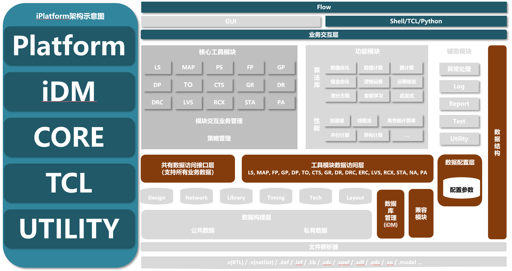

# iGUI - 交互界面

## 1. 简介

iPLF，iEDA Platform的缩写，是iEDA软件的核心平台层，整合了各个点工具的外部接口并进行二次封装以便各个点工具调用；集成了所有点工具和模块的TCL命令提供给iEDA调用；集成了基于iEDA各个点工具和子模块的流程接口，既可支持iEDA autorun flow，也可以支持基于命令行或者GUI的交互操作；集成了对iDB的数据库管理器iDM，可支持iEDA软件运行时对统一的数据库进行操作。

### 1.1 设计需求和目标

提供iEDA的系统平台顶层设计，支持iEDA auto run flow，支持iEDA的TCL交互以及GUI交互，并为各个点工具和功能模块提供顶层接口，提供基础数据结构管理器。

### 1.2 专有名词

| **名词** | **解释**                       |
| -------------- | ------------------------------------ |
| iPLF           | iEDA Platform iEDA平台层             |
| iDM            | iEDA Database Manager iEDA数据管理器 |
|                |                                      |
|                |                                      |
|                |                                      |
|                |                                      |

### 1.3 参考文档

> 格式为    方法关键词：对应方法的论文标题

### 1.4 使用说明

#### 1.4.1 参数配置

iEDA运行需要提前配置好参数，配置文件存放在./config文件夹下，其中，

##### 1.4.1.1 flow_config.json

配置决定了iEDA Flow的流程，控制了整个软件运行时可运行的模块，参数如下：

| 模块名     | 参数      | 参数说明                         | 选项                    |
| :--------- | :-------- | :------------------------------- | :---------------------- |
| Tools      | TCL       | 控制是否支持TCL命令交互方式      | ON  打开<br /> OFF 关闭 |
| Flow       | Synthesis | 暂时不支持逻辑综合点工具         | /                       |
|            | Floorplan | 控制是否支持Floorplan功能        | ON 打开<br />OFF 关闭   |
|            | Placer    | 控制是否支持Place功能            | ON 打开<br />OFF 关闭   |
|            | CTS       | 控制是否支持CTS功能              | ON 打开<br />OFF 关闭   |
|            | PA        | 控制是否支持PA（Pin Access）功能 | ON 打开<br />OFF 关闭   |
|            | Router    | 控制是否支持Routing功能          | ON 打开<br />OFF 关闭   |
|            | DRC       | 控制是否支持DRC功能              | ON 打开<br />OFF 关闭   |
| ConfigPath | idb_path  | 指定iDB数据库配置路径            |                         |
|            | ifp_path  | 指定iFP参数配置路径              |                         |
|            | ipl_path  | 指定iPL参数配置路径              |                         |
|            | ipa_path  | 指定iPA参数配置路径              |                         |
|            | irt_path  | 指定iRT参数配置路径              |                         |
|            | idrc_path | 指定iDRC参数配置路径             |                         |
|            | icts_path | 指定iCTS参数配置路径             |                         |

下面是flow config一个例子，可参考如下：

```
{
    "Tools": {
        "TCL": "ON"
    },
    "Flow": {
        "Synthesis": "OFF",
        "Floorplan": "OFF",
        "Placer": "OFF",
        "CTS": "ON",
        "PA": "OFF",
        "Router": "OFF",
        "DRC": "ON"
    },
    "ConfigPath": {
        "idb_path": "/home/Project/iEDA/bin/config/db_default_config_ifp.json",
        "ifp_path": "/home/Project/iEDA/bin/config/fp_default_config_new.json",
        "ipl_path": "/home/Project/iEDA/bin/config/pl_default_config.json",
        "ipa_path": "/home/Project/iEDA/bin/config/pa_default_config.json",
        "irt_path": "/home/Project/iEDA/bin/config/rt_default_config.json",
        "idrc_path": "/home/Project/iEDA/bin/config/drc_default_config.json",
        "icts_path": "/home/Project/iEDA/bin/config/cts_default_config.json"
    }
}
```

##### 1.4.1.2 db_default_config.json

配置iEDA软件的数据输入、输出路径，参数如下

| 模块名 | 参数            | 参数说明                                       |
| ------ | --------------- | ---------------------------------------------- |
| INPUT  | tech_lef_path   | 工艺文件Tech LEF路径                           |
|        | lef_paths       | LEF文件路径列表                                |
|        | def_path        | DEF文件路径                                    |
|        | verilog_path    | 网表文件路径                                   |
| OUTPUT | output_dir_path | 输出路径，iEDA相关点工具输出结果将保存在此路径 |

json配置文件如下：

```
{
    "INPUT": {
        "tech_lef_path": "<tech_lef_path>",
        "lef_paths": [
            "<lef_path1>",
            "<lef_path2>",
            "<lef_path3>"
        ],
        "def_path": "<def_path>",
        "verilog_path": "<verilog_path>"
    },
    "OUTPUT": {
        "output_dir_path": "<output_dir_path>"
    }
}
```

##### 1.4.1.3 fp_default_config.json

参考iFp配置文件说明。

##### 1.4.1.4 pl_default_config.json

参考iPL配置文件说明

##### 1.4.1.5  cts_default_config.json

参考iCTS配置文件说明。

##### 1.4.1.6 pa_default_config.json

参考iPA配置文件说明。

##### 1.4.1.7 rt_default_config.json

参考iRT配置文件说明。

##### 1.4.1.8 drc_default_config.json

参考iDRC配置文件说明。

#### 1.4.2 程序运行

iEDA支持三种交互操作方式，包括：

#### 1.4.2.1 脚本交互

通过编写python和TCL脚本实现自动化运行芯片设计P&R流程；

比如Floorplan的脚本，可参考以下例子，

通过python脚本启动iEDA和TCL脚本，如下：

```
#!/bin/python3
import os
import re
import sys
import argparse  # argument parsing
import time

result_time = time.strftime('%m_%d',time.localtime(time.time()))
os.environ['iFP_RESULT_TIME'] = result_time
os.system('mkdir -p ./result/{0}'.format(result_time))
os.system('./iEDA gtest.tcl')
```

FP的主流程TCL脚本如下：

```

#read LEF & DEF 
idb_init -config /home/Project/iEDA/bin/config/db_default_config_ifp.json

#run FP
create_floorplan

# init FP
set DIE_AREA "0.0    0.0   3920.01   3920.01"
set CORE_AREA "159.90 157.44 3759.7 3758.88"
set PLACE_SITE HD_CoreSite
set IO_SITE IOSite

init_floorplan \
   -die_area $DIE_AREA \
   -core_area $CORE_AREA \
   -core_site $PLACE_SITE \
   -io_site $IO_SITE


# operator
source ./iFP_script/asic_top.io.tcl
source ./iFP_script/macro_place.tcl
source ./iFP_script/place_pad_new.tcl

#filler
placeIoFiller \
   -filler_types "PFILL50W PFILL20W PFILL10W PFILL5W PFILL2W PFILL01W PFILL001W" \
   -prefix IOFIL

#tap cell
tapcell \
   -tapcell LVT_FILLTIEHD \
   -distance 32.5 \
   -endcap LVT_F_FILLHD1

# pdn
source ./iFP_script/addPowerStripe.tcl
source ./iFP_script/connect_power_io.tcl

# output
write_def "./result/$RESULT_TIME/iEDA2_FP_cl.def"

```

##### 1.4.2.2 TCL命令运行交互

通过Linux终端输入TCL命令实现芯片设计的相关操作；具体的TCL命令，请参考[TCL命令手册](https://e.gitee.com/i-eda/docs/969974/file/2640454?sub_id=5637877)。

##### 1.4.2.3 GUI交互

通过图形界面交互方式操作各个功能；具体的操作请参考iGUI使用手册。

## 2. 整体设计

### 2.1 总体架构



*图2.1 iPLF架构示意图*

iPLF作为系统平台层，设计了顶层P&R流程，并从接口层面统一了模块API，规范了模块间互相调用方式，满足某些功能需要组合模块功能实现的需求，并统一了数据、流程、报告等的管理，具体如下：

* 集成了各个点工具、功能模块的外部接口，为iEDA提供统一的调用接口；
* 集成各个点工具流程，构建P&R顶层流程；
* 集成各个点工具TCL命令，为TCL命令交互提供统一接口；
* 提供iDB数据管理器，为iEDA提供统一的数据交互管理接口；
* 集成GUI交互模块，提供统一的GUI交互接口；
* 设计统一的报告规范、LOG规范等。

### 2.2 软件流程

iPLF本身作为系统平台，一是作为顶层模块关联、管理各个模块的接口层进行设计；二是构建顶层Flow，具体流程参考子模块设计的2.3.1 iPlatform模块。

### 2.3 子模块设计

> *描述软件的各个组成子模块的设计，独立完成功能，相互依赖关系等。这些模块的情况*

2.3.1 iPlatform模块

2.3.2 iDM模块（DataManager）

2.3.3 core模块

2.3.4 tcl模块

2.3.5 utility

### 2.4 评价指标

### 2.5 算法设计

> *描述软件用到的主要算法，可以用伪代码的形式描述。*

### 2.6 数据结构设计

> *描述用到的主要数据结构，包括类的设计，继承关系等等*

## 3. 接口设计

### 3.1 外部接口

> *包括用户界面、软件接口。*

iEDA各个功能模块的运行都依赖于iPLF对应的接口，而iPLF集成了iEDA软件可支持的所有功能模块，划分如下：

#### 3.1.1 iDM

#### 3.1.2 Core

### 3.2 内部接口

> *内部模块之间的接口。*

## 4. 测试报告

### 4.1 测试环境

> *描述测试环境。*

### 4.2 测试结果

> 描述测试人员应该覆盖的功能点

| **测试****编号** | **测试****版本** | **测试功能点** | **测试****描述** |
| ---------------------- | ---------------------- | -------------------- | ---------------------- |
| TR01                   | V1.0                   |                      |                        |
| …                     | …                     | …                   | …                     |

### 4.3 比对

*图、表描述与第三方的性能比对。*

拥塞图对比

## 5. TO BE DONE

### 5.1 疑难问题

> *描述重点难点问题* ；
>
> *说明在开发过程中遇到的问题，以及解决方法。例如：方法的选择、参数的处理、需要说明的其他具体问题。如果有不能正常工作的模块，说明具体情况，猜测可能的原因。*

### 5.2 待研究

> *待研究问题；神经网络评估：使用上述评估值作为特征，用CNN模型，预测真正的拥塞/最终DRVs违例，待研*
