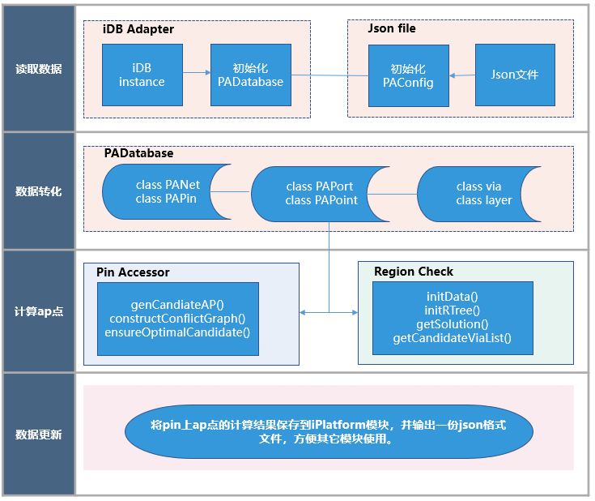

# iPA - 引脚链接

# 1.简介

在数字电路物理设计中，物理综合(physical synthesis)阶段包括了布局(placement)和布线(routing)两部分。布局(placement)确定逻辑单元的位置，以最小化一些成本函数（主要是最小化导线长度函数)，从而减轻下一个设计步骤的努力。布线(routing)旨在连接网表的各个组件(components)，同时最小化WL。由于两者都要评估线长(WL)，因此，在布局和布线之前需要明确各个组件(component)的输入输出引脚(pin/terminal)上的金属线连接点(pa, pin accessor)。

iPA模块主要用于，在满足设计约束的前提下，确定各个组件(component)引脚(pin/terminal)上最优的金属线连接点(pa点)。本模块从iDB中读入数据，选择最优ap点，并将结果存如iPlatform模块，供各个模块使用。

## 1.1 设计需求和目标

* pa点需在pin shape上的track交点中选择。
* 不同pin上的pa点要根据冲突图来避免冲突。
* 对于pin shape上不包含track交点的场景，生成补丁(jog)将ap偏移到周围的track交点上。

## 1.2 专有名词

| 名词 | 解释                                                                        |  |
| ---- | --------------------------------------------------------------------------- | - |
| pin  | 引脚， 网表中各个组件component的输入/输出端口。                             |  |
| port | pin的组成部分，包含矩形(pin shape)和矩形所在层信息。                        |  |
| pa   | pin accessor，pin上用于被金属线wire连接的点。                               |  |
| via  | 通孔，连接上下相邻两层金属线。                                              |  |
| jog  | 针对pin shape上不包含track交点的场景，需要jog将pin连接到周围的track交点上。 |  |
| wire | 金属线，用于连接pa点或组成Jog.                                              |  |

## 1.3 使用说明

iPA的使用流程为：设置配置文件参数 -> 产生ap点 ->返回数据。

运行程序：编译iPA后产生可执行文件run_pa，在run_pa存放位置运行下行命令。

`run_pa <pa_config.json>                                                             `

其中，配置文件默认为json文件，pa_default_config.json文件详细属性如下所示

```
{
    "PA": {
        "lef_file_list": [
            "/home/benchmark/lef/scc011u_8lm_1tm_thin_ALPA.lef",
            "/home/benchmark/lef/scc011ums_hd_hvt.lef",
            "/home/benchmark/lef/scc011ums_hd_rvt.lef",
            "/home/benchmark/lef/scc011ums_hd_lvt.lef",
            "/home/benchmark/lef/S013PLLFN_8m_V1_2_1.lef",
            "/home/benchmark/lef/SP013D3WP_V1p7_8MT.lef",
            "/home/benchmark/lef/S011HD1P256X32M2B0.lef",
            "/home/benchmark/lef/S011HD1P512X58M2B0.lef",
            "/home/benchmark/lef/S011HD1P1024X64M4B0.lef",
            "/home/benchmark/lef/S011HD1P256X8M4B0.lef",
            "/home/benchmark/lef/S011HD1P512X73M2B0.lef",
            "/home/benchmark/lef/S011HD1P128X21M2B0.lef",
            "/home/benchmark/lef/S011HD1P512X19M4B0.lef",
            "/home/benchmark/lef/S011HDSP4096X64M8B0.lef"
        ],
        "def_file": "/home/benchmark/def/iEDA_TO_io_0215.def",
        "guide_file": "/home/liujikang/new_iEDA/iEDA_TO.guide",
        "output_def_file": "/home/liujikang/new_iEDA/out.def",
        "temp_directory": "/home/liujikang/new_iEDA/",
        "PinAccessor": {
            "routing_size": 1,
            "gcell_size": 6560
        }
    }
}
```

> pa配置文件属性说明：

| 模块名 | 参数            | 参数说明                                    |
| ------ | --------------- | ------------------------------------------- |
| INPUT  | lef_file_list   | lef工艺文件路径，默认使用公共目录下的文件。 |
|        | def_file        | def文件路径。                               |
|        | guide_file      | GR输出结果的guide文件路径。                 |
| OUTPUT | output_def_file | def文件的输出位置。                         |
|        | temp_directory  | 存放中间文件的目录。                        |
| param  | gcell_size      | gcell大小。                                 |
|        | routing_size    | 每个panel包含的gcell的个数。                |

# 2 整体设计

## 2.1 总体架构

iPA总体架构如下图所示，其中：


* **Database：** iPA数据结构包括**基本数据结构(basic)**和**PA特有数据结构**
  * PADataManager：管理iPA模块所有数据，包括从数据库和配置文件中读取的数据。
  * PADatabase：保存设计相关的数据，数据来源包括从iDB数据库、外部lef def文件中读取的数据，和iPA模块生成的中间数据。
  * PAConfig：从外部json配置文件中读取的数据。
* **PinAccessor：** 基于database数据选择最优pa点
  * 计算pin shape(port)包含的候选ap点，包括所有track交点(kOngrid)、track中点(kOntrak)、pin shape中心点(kShapeCenter)。并对不同类型的候选ap点添加相应的cost。
  * 检查候选ap点的合法性，并确定合法的via在via_lib中的下标。并对ap点的via enclosure与pin shape进行边缘检查，via-enclosure超出pin shape时添加外部enclosure的cost。
  * 构建冲突图：
    * 初始化panel中的候选ap点。
    * 对panel中的所有候选ap点按照panel方向进行排序。
    * 计算并保存不同pin的候选ap点之间的冲突关系。
  * 选择最优ap点：
    * 计算冲突cost，计算当前port所有候选ap点与已选中最优ap之间的冲突cost。
    * 使用贪婪算法，在port所有候选ap点中，选择总cost最小的ap点作为最优ap点，加入到最优ap点列表。重复这一过程，直至所有port都确定其最优ap点。
    * 对每个port的所有候选点ap点按照总cost进行排序。
  * 更新pin数据信息：
    * 汇总各个port的候选ap点信息，保存到对应pin的ap点列表中。
    * 候选ap点去重处理。
    * 保留前三个总cost最小的候选ap点。
* **RegionCheck：**
  * 建立资源管理器，以RTree的形式保存各个资源。
  * 提供ap点坐标合法的via的检查接口。
  * 提供资源的合法性检查接口。

## 2.2 软件流程



## 2.3 子模块设计

> 描述软件的各个组成子模块的设计，独立完成功能，相互依赖关系等。这些模块的情况

### 2.3.1 Pin Accessor子模块

> Pin Accessor子模块为iPA的核心子模块。
>
> **功能：**
>
> 1. 生成候选pa点。
> 2. 计算不同pin的候选pa点之间的冲突关系。
> 3. 根据贪婪算法，确定每个pin的最优pa点，并确定pin上所有候选pa点与最优pa的冲突成本。
> 4. 保留前三个总成本最小的pa点保存到iPlatform模块。
>
> **依赖关系：**
>
> Pin Accessor模块在合法性检查时需要调用Region Check模块，依赖Region Check的场景包括：
>
> 1. 生成候选pa点时，调用Region Check判断pa点坐标的合法性。
> 2. 确定候选pa点的通孔时，通过Region Check获得当前pa点可用通孔的列表。
> 3. 针对non-grid类型的候选pa点生成Jog时，调用Region Check判断Jog的合法性。
>
>> **数据结构：**
>>

#### 2.3.1.1 PAConfig.h

>> PA模块的配置文件信息
>>
>
> ```
> // _routing_size和_gcell_size需要和iRT保持一致
> ipa_int _routing_size; // 布线区域gcell的个数
> ipa_int _gcell_size;   // 布线gcell的边长(GCell是一个正方形)
> ```

#### 2.3.1.2 PADatabase.h

> PA模块的数据信息

```
Rectangle<ipa_int> _die;			// die的区域大小
std::vector<Net> _net_list;                     // idb读取的线网集合
std::vector<Blockage> _blockage_list;           // blockage列表
std::vector<RoutingLayer> _routing_layer_list;  // 布线层信息
std::vector<Via> _via_lib;			// 通孔库

std::vector<PAPin*> _pa_pin_list;		  // 临时保存pin信息
std::vector<std::vector<PAPanel>> _pa_panel_list; // 临时保存panel信息
```

#### 2.3.1.3 PAPanel.h

> PA模块用于划分不同布线区域时使用

```
Rectangle<ipa_int> _panel_region;	// panel对应的shape大小
RoutingTrack _panel_track;  		// panel中包含的track信息
std::vector<PAPort*> _pa_port_list;	// panel中包含的pin shpe信息以port形式保存
std::vector<PAPoint*> _pa_point_list;   // panel中包含的pin shape上的pa点的list
```

#### 2.3.1.4 PAPin.h

> PA模块保存的Pin信息

```
std::string          _pin_name;		// idb_pin_instance_name + "/" + idb_pin_name 拼接而成
Coordinate<ipa_int>  _pin_coord;	// pin shape的feature坐标
std::vector<PAPort>  _pa_port_list;	// pin shape列表
std::vector<PAPoint> _pa_point_list;    // pin shape上的连接点(pa)点列表
```

#### 2.3.1.5 PAPort.h

> PA模块保存的pin shape信息

```
ipa_int _pa_pin_idx = -1;			// 当前pin shape所属pin的id
ipa_int _layer_idx = -1;			// 当前pin shape所属层信息
std::vector<Rectangle<ipa_int>> _shape_list;	// pin shape集合
std::vector<PAPoint> _pa_point_list; 		// pin shape上pa点集合
```

#### 2.3.1.6 PAPoint.h

> Pin的连接点(pa点)

```
 	Coordinate<ipa_int> _coord;		// pa点坐标
ipa_int _layer_idx = -1;			// pa点所在层信息
ipa_int _net_idx = -1;				// pa点所属的pin所在的net
ipa_int _pa_pin_idx = -1;			// pa点所属的pin的id
PAPointType _point_type = PAPointType::KNone;   // pa点类型，包括grid/track/offtrack三种
std::vector<Via> _via_lib;		        // 通孔库
std::vector<ipa_int> _optional_via_idx_list;    // pa点上可以使用的via在via_lib中的下标

// 当pa点不是onGrid类型时，需要偏移到pin shape周围的track交点上
// map_key是偏移后的track交点，map_value是从pa点到偏移后track交点之间的布线结果
std::map<Coordinate<ipa_int>, std::vector<PANode>, cmpCoordinateXASC<ipa_int>> _coord_jog_map; 
// temp
double _total_cost = 0.0;     // pa点选择的总cost
double _coord_cost = 0.0;     // pa点坐标对应类型kOnGrid/kOnTrack/kOnCenter的cost
double _conflict_cost = 0.0;  // pa点与周围其他net的pa点之间的冲突cost
std::map<Coordinate<ipa_int>, double, cmpCoordinateXASC<ipa_int>> _conflict_cost_map;
```

#### 2.3.1.7 PAPointType.h

> PA点坐标类型


```
enum class PAPointType
{
  kOnGrid = 0,
  kOnTrack = 1,
  kShapeCenter = 2,
  kOffset = 3,
  KNone = 4
};

```

### 2.3.2 Region Check子模块

> iPA的合法性检查模块。
>
> **功能：**
>
> 1. 候选pa点的合法性检查。
> 2. 返回候选pa点所有合法的via列表。
> 3. 金属wire的合法性检查。
>
> **依赖关系：**
>
> 为Pin Accessor模块提供合法性检查功能。
>
>> **数据结构：**
>>

#### 2.3.2.1 RCBlockage.h

> RC检查模块保存blockage信息

```
BoostBox _shape;	     // blockage shape矩形转换为BoostBox类型
ipa_int _min_spacing = -1;   // blockage所在层的最小间距
BoostBox _enlarged_shape;    // blockage shape矩形使用_min_spacing膨胀后矩形
ipa_int _layer_idx = -1;     // blockage所在层
```

#### 2.3.2.2 RCBoostHeader.h

> 自定义boost数据类型

```
namespace gtl = boost::polygon;
using namespace boost::polygon::operators;

namespace bg = boost::geometry;
namespace bgi = boost::geometry::index;

using BoostPoint = bg::model::d2::point_xy<ipa_int, bg::cs::cartesian>;
using BoostBox = bg::model::box<BoostPoint>;
```

#### 2.3.2.3 RCNet.h

> RC模块保存线网信息

```
std::vector<Port> _port_list;					// pin shape list
std::map<ipa_int, std::vector<RCNetShape*>> _obj_id_shape_map;  // 线网id与组成线网的components矩形的map
```

#### 2.3.2.4 RCWire.h

> RC模块保存金属线信息

```
Segment<Coordinate<ipa_int>> _segment;	// 线段起点和终点
ipa_int _layer_idx = -1;		// 线段所在层
ipa_int _wire_width = -1;		// 线段所在层的最小线宽去
```

#### 2.3.2.5 RCVia.h

> RC模块保存通孔信息

```
Coordinate<ipa_int> _coord;	// 通孔坐标
ipa_int _via_idx = -1;		// 通孔在通孔库(via_lib)中的下标
```

# 3. 接口设计

## 3.1 外部接口

> Pin Accessor的实例接口

---

### 3.1.1 Pin Accessor**实例创建接口**

> 只需传入pa配置文件(pa_config.json)和iBD的实例，即可创建Pin Accessor对象。
>
> ```
> PinAccessor::getInst(pa_config, idb_builder)
>
> PinAccessor& PinAccessor::getInst(std::string config_file_path, PCL::iDB::IdbBuilder* idb_builder)
> {
>   if (pa_instance == nullptr) {
>     pa_instance = new PinAccessor(config_file_path, idb_builder);
>   }
>   return *pa_instance;
> }
>
> ```

---

### 3.1.2  Pin Accessor**功能函数接口**

> 使用Pin Accessor实例调用此功能函数。

`PinAccessor::getInst(pa_config_file, idb_builder).accessPin()                                                              `

```
void PinAccessor::accessPin()
{
  genCandidateAp();
  sortPAPortByPointNum();
  constructConflictGraph();
  ensureOptimalCandidate();
  updatePAPinList();
  generateJogForPAPoint();
  updateOriginNet();
  outputPAPointIntoJson();
  writeGDSForPanel();
}
```

---

### 3.1.3Pin Accessor**数据输出接口**

> 使用Pin Accessor实例调用数据输出接口。

`PinAccessor::getInst(pa_config_file, idb_builder).updateAPToTrt()`

```
std::map<std::string, std::map<std::string, std::vector<PAPoint>>> PinAccessor::updateAPToIrt()
{
  std::map<std::string, std::map<std::string, std::vector<PAPoint>>> net_pin_ap_map;

  PADatabase&       pa_database = _pa_data_manager.getDatabase();
  std::vector<Net>& net_list    = pa_database.get_net_list();
  for (size_t i = 0; i < net_list.size(); i++) {
    std::map<std::string, std::vector<PAPoint>> pin_name_ap_map;
    std::vector<PAPin>& pin_list = net_list[i].get_pin_list();
    for (size_t j = 0; j < pin_list.size(); j++) {
      PAPin&                pa_pin        = pin_list[j];
      std::string           pin_name      = pa_pin.get_pin_name();
      std::vector<PAPoint>& pa_point_list = pa_pin.get_pa_point_list();

      pin_name_ap_map.insert({pin_name, pa_point_list});
    }

    std::string net_name = net_list[i].get_net_name();
    net_pin_ap_map.insert({net_name, pin_name_ap_map});
  }

  return net_pin_ap_map;
}
```

## 3.2 内部接口

---

### 3.2.1 候选pa点的生成接口

> 功能：
>
> * 对panel中每个PAPort，生成候选pa点，候选pa点的类型包括，包括所有track交点(kOngrid)、track中点(kOntrak)、pin shape中心点(kShapeCenter)。并对不同类型的候选ap点添加相应的cost。
> * 确定每个获选pa点的合法via。

```
void PinAccessor::genCandidateAp()
{
  double     start_time = COMUtil::microtime();
  PADatabase& pa_design = _pa_data_manager.getDatabase();
  std::vector<RoutingLayer>& routing_layer_list = pa_design.get_routing_layer_list();
  std::vector<std::vector<PAPanel>>& pa_panel_list = pa_design.get_pa_panel_list();
  for (size_t i = 0; i < pa_panel_list.size(); i++) {
    double layer_start_time = COMUtil::microtime();

    for (size_t j = 0; j < pa_panel_list[i].size(); j++) {
      std::vector<PAPort*>& pa_port_list = pa_panel_list[i][j].get_pa_port_list();
      for (size_t k = 0; k < pa_port_list.size(); k++) {
        genAndSaveCanAPOnShape(pa_port_list[k]);
      }
    }
  }
  double end_time = COMUtil::microtime();
  Logger::info("PinAccessor", "Generate candidate ap time:", (end_time - start_time), "s");
}
```

---

### 3.2.2 构建冲突图接口

> 根据panel方向对当前panel里的每个PAPort，计算当前PAPort与周围其它PAPort的候选ap点之间

```
void PinAccessor::buildConflictGraph()
{
  double start_time = COMUtil::microtime();
  Logger::info("PinAccessor", "Start build conflict graph");

  PADatabase& pa_db = _pa_data_manager.getDatabase();
  std::vector<RoutingLayer>& routing_layer_list = pa_db.get_routing_layer_list();
  std::vector<std::vector<PAPanel>>& pa_panel_list = pa_db.get_pa_panel_list();
  for (size_t i = 0; i < pa_panel_list.size(); ++i) {
    double layer_start_time = COMUtil::microtime();

    for (size_t j = 0; j < pa_panel_list[i].size(); ++j) {
      calcCanAPConflictRelation(pa_panel_list[i][j]);
    }

    double layer_end_time = COMUtil::microtime();
    Logger::info("PinAccessor", "Processed ", routing_layer_list[i].get_layer_name(), " panels:", (layer_end_time - layer_start_time), "s");
  }

  double end_time = COMUtil::microtime();
  Logger::info("PinAccessor", "Build conflict graph time:", (end_time - start_time), "s");
}
```

---

### 3.2.3 计算最优pa点接口

> 使用贪婪算法，在port所有候选ap点中，选择总cost最小的ap点作为最优ap点，加入到最优ap点列表。重复这一过程，直至所有port都确定其最优ap点。对每个port的所有候选点ap点按照总cost进行排序。

```
void PinAccessor::ensureOptimalCandidate()
{
  double start_time = COMUtil::microtime();

  std::map<Coordinate<ipa_int>, PAPoint*, cmpCoordinateXASC<ipa_int>> opt_point_list;

  PADatabase&                        pa_database   = _pa_data_manager.getDatabase();
  std::vector<std::vector<PAPanel>>& pa_panel_list = pa_database.get_pa_panel_list();
  for (size_t i = 0; i < pa_panel_list.size(); ++i) {
    for (size_t j = 0; j < pa_panel_list[i].size(); ++j) {
      std::vector<PAPort*>& pa_port_list = pa_panel_list[i][j].get_pa_port_list();
      for (size_t k = 0; k < pa_port_list.size(); ++k) {
        calcOptPAPointIdxOnPort(pa_port_list[k], opt_point_list);
      }
      opt_point_list.clear();
    }
  }
```

---

### 3.2.4  更新PAPin数据接口

> 汇总PAPin各个PAPort的候选ap点信息，保存到对应pin的ap点列表中。对候选ap点去重处理。保留前三个总cost最小的候选ap点。

```
void PinAccessor::updatePAPinList()
{
  getPAPointList();
  uniquePAPoint();
  saveTopThreePAInPin();
}
```

---

### 3.2.5 生成补丁(Jog)接口

> 针对kOntrack和kShapeCenter类型的pa点生成补丁(Jog)，从而将pa点偏移到周围的track交点上。
>
> 针对每个pin所属的rrouter将pa点分为rrouter外pa点和rrouter内pa点，分别生成Jog。

```
void PinAccessor::generateJogForPAPoint()
{
  double start_time = COMUtil::microtime();

  ipa_int              num_outer_ap = 0;
  PADatabase&          pa_database  = _pa_data_manager.getDatabase();
  std::vector<PAPin*>& pa_pin_list  = pa_database.get_pa_pin_list();
  for (size_t i = 0; i < pa_pin_list.size(); i++) {
    std::vector<PAPoint>& pa_point_list = pa_pin_list[i]->get_pa_point_list();
    std::pair<Coordinate<ipa_int>, std::vector<PANode>> grid_jog;
    for (size_t j = 0; j < pa_point_list.size(); j++) {
      PAPoint&           pa_point  = pa_point_list[j];
      Rectangle<ipa_int> rr_region = getRouterRegionByPA(pa_point);

      if (COMUtil::rectContainPoint(rr_region, pa_point.get_coord())) {
        genJogForPAInRouter(pa_point);
      } else {
        grid_jog = genJogForPAOutRouter(pa_point, rr_region);
        pa_point.get_coord_jog_map().insert(grid_jog);
        ++num_outer_ap;
      }
    }
  }

  double end_time = COMUtil::microtime();
  Logger::info("PinAccessor", "Generate jog time:", (end_time - start_time), "s");
  Logger::info("PinAccessor", "There are ", num_outer_ap, " out-router ap with jog.");
}
```

---

### 3.2.6  更新pa数据接口

> 每个pin选择cost最小的前三个pa点，返回到iPlatform模块，供后续模块使用。

```
void PinAccessor::updateOriginNet()
{
  double start_time = COMUtil::microtime();

  PADatabase&       pa_database = _pa_data_manager.getDatabase();
  std::vector<Net>& net_list    = pa_database.get_net_list();

  /// calculate pa pin size
  int size = 0;
  for (size_t i = 0; i < net_list.size(); i++) {
    std::vector<PAPin>& pin_list = net_list[i].get_pin_list();
    size += pin_list.size();
  }
  iplf::PaDataManager::getInstance()->initPaPinSize(size);

  for (size_t i = 0; i < net_list.size(); i++) {
    std::vector<PAPin>& pin_list = net_list[i].get_pin_list();
    for (size_t j = 0; j < pin_list.size(); j++) {
      PAPin pa_pin = pin_list[j];
      iplf::PaDataManager::getInstance()->addPaPinMap(pa_pin.get_pin_name(), pa_pin);
    }
  }

  double end_time = COMUtil::microtime();
  Logger::info("PinAccessor","Update origin net time:",(end_time - start_time), "s");
}
```

# 4. 测试报告

## 4.1 测试环境

*描述测试环境*

## 4.2 测试结果
