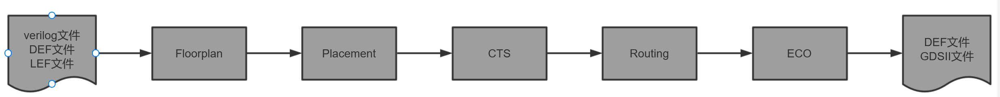
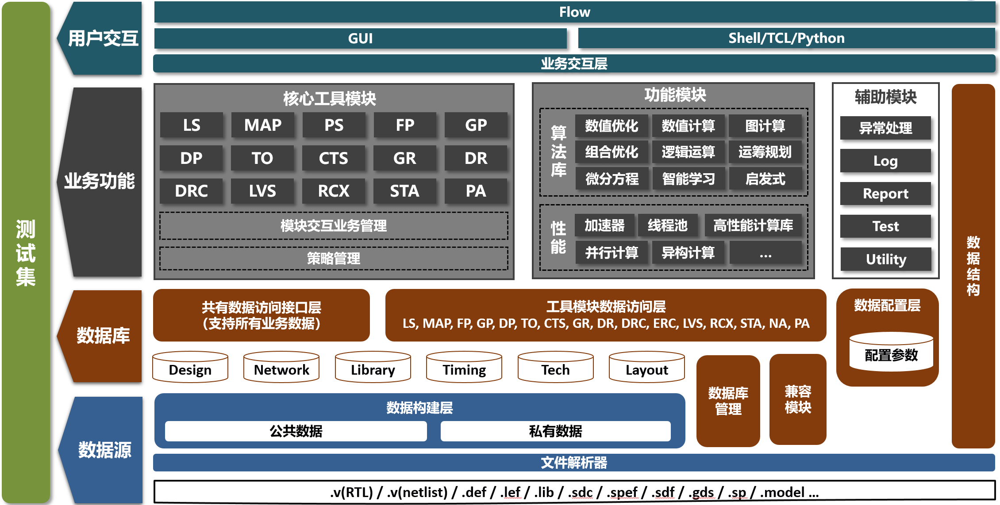
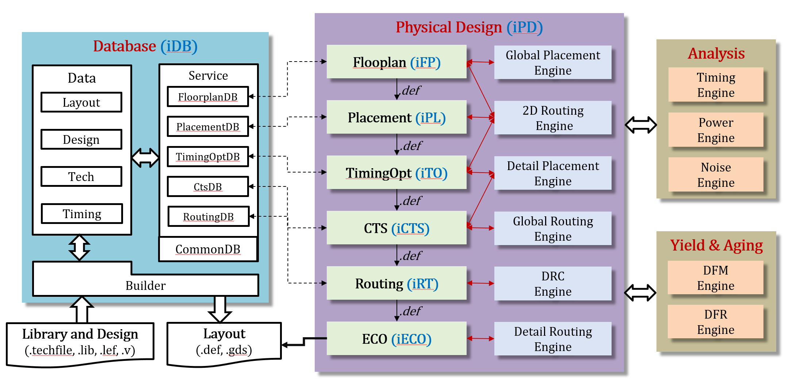

# iPD - 物理设计

## 1. 简介

> *简要描述设计的背景、编写目的、目标读者等；*

iEDA是一个聚焦在芯片物理后端设计的开源EDA平台软件，支持从读入RTL设计文件到输出GDSII文件的全流程芯片设计 。

*图1.1* *iEDA物理后端设计流程*

### 1.1 设计需求和目标

> *描述需求和目标。*

iEDA支持110nm芯片物理后端设计整体流程，包括软件整体框架设计、数据处理、模块业务、交互层设计、GUI设计、TCL命令、设计报告等，按模块划分主要包含以下内容：

* 数据解析： 支持解析verilog文件、LEF文件、DEF文件；
* 布图规划： 支持芯片的布图规划功能；

* 布局：支持芯片的单元布局；
* 时钟树综合：

* 布线：
* 静态时序分析：

* 设计规则检查：
* ECO：

* 版图可视化：支持P&R、DRC等工具产生的结果可视化。

### 1.2 专有名词

| **名词（缩写）** | **详细定义**                                                         |
| ---------------------- | -------------------------------------------------------------------------- |
| EDA                    | Electronic design automation  电子设计自动化                               |
| PD                     | Physical Design 物理设计                                                   |
| P&R                    | Place and Routing 布局布线                                                 |
| iFP                    | iEDA Floorplan iEDA的布图规划点工具                                        |
| iPL                    | iEDA Placement iEDA的布局工具                                              |
| iCTS                   | iEDA Clock Tree Synthesis iEDA的时钟树综合工具                             |
| iRT                    | iEDA Router iEDA的绕线工具                                                 |
| iDRC                   | iEDA  Design Rule Check iEDA的设计规则检查工具                             |
| iECO                   | iEDA Engineer Changing Order iEDA的修复工具，主要针对P&R流程的问题进行修复 |
| iSTA                   | iEDA Static  Timing Analysis iEDA的静态时序分析工具                        |
| iEval                  | iEDA Evaluator iEDA的线长、时序、密度等维度的评估器                        |
| iPLF                   | iEDA Platform iEDA的系统平台模块                                           |
| iDB                    | iEDA Database iEDA的基础数据结构                                           |
| iGUI                   | iEDA Graphical User Interface iEDA的图形交互界面                           |
| LEF                    | Library Exchange Format                                                    |
| DEF                    | Design Exchange Format                                                     |
| GDSII                  | Geometry Data Standard II 用于集成电路版图的数据转换的数据库文件格式       |

### 1.3 参考文档

### 1.4 使用说明

> *每一个模块*  */*  *核心类*  */* *子程序的功能，需要的参数，截屏*

#### 1.4.1 iEDA Flow

iEDA工具支持三种模式，包括iEDA auto run、iEDA脚本运行、iEDA点工具单独运行，其中

初始化整个设计，设置 die 的面积，生成 row、track 等基本信息

* Auto run：支持iEDA软件配置好参数文件后，运行从布图规划到绕线输出结果的流程，具体参考iPlatform；
* iEDA脚本：支持运行python+TCL命令文件方式，运行从布图规划到绕线输出结果的流程，具体参考iEDA-script；
* 点工具单独运行：支持各个点工具单独运行，具体参考各个点工具的操作手册。

#### 1.4.2 iGUI交互

支持从图形交互工具对iEDA各个点工具进行操作、运行，并可视化输出结果，具体操作请参考iGUI。

#### 1.4.4 TCL交互

支持从linux终端直接输入TCL命令操作各个点工具，具体操作请参考iFP和iEDA TCL手册。

## 2. 整体设计

### 2.1 总体架构

iEDA 总体软件架构采用三层架构思想，包含数据访问层、业务逻辑层、表示层，其中业务逻辑层包含核心工具模块、算法库、性能库、辅助模块等，囊括了P&R流程关键点工具、关键算法实现、性能加速库等，并在软件运行过程根据需要调用辅助模块相应功能，如下图所示：

*图2.1 iEDA总体架构图*

#### 2.1.1数据访问层

* 文件解析器 ：提供芯片设计中涉及的各类文件解析，主要包含RTL网表文件（.v文件）、工艺文件（LEF文件、lib文件、spef文件、sdc文件等）、设计文件（DEF文件、GDSII文件等）。
* 数据库：通过文件解析器解析的数据进行封装后，形成基础数据库iDB，在整个iEDA软件各个点工具模块运行中，提供统一的数据；
* 数据库管理：通过iPlatform中的iDM模块，对数据库的各类数据进行功能封装，支持各种业务数据的增删改查等常规操作，支持跨工具、跨模块的数据构建；

#### 2.1.2 业务逻辑层

* 核心工具模块：提供P&R流程中的各个关键业务功能，比如Floorplan、Place、Routing、STA等；
* 算法库：将iEDA中使用的各种算法抽象封装后，形成算法库；
* 性能模块：通过设计加速器、线程池、内存池等方式，为iEDA各个点工具提供各种相关算法、功能接口提升软件性能；

#### 2.1.3 表示层

* 业务交互层：通过iPlatform里面的core模块，封装了当前点工具的流程接口、外部功能接口等，形成顶层接口，提供给各个子模块使用；
* Flow/GUI/TCL/Tython：iEDA提供多种交互操作方式，满足对模块、数据、算法等接口的操作；
* Flow：通过各类功能接口，实现iEDA全流程运行；

#### 2.1.4 辅助模块

* 异常处理：
* Log：
* Report
* Test：
* Utility：

#### 2.1.5 测试集

#### 2.1.6 数据结构

### 2.2 软件流程

> 描述软件的总体处理流程，**用文字描述清楚整个运行过程，并附上相应的代码**

*图2.2 iEDA软件整体流程图*
