# iDRC - 设计规则检查

# 1. 简介

**背景**

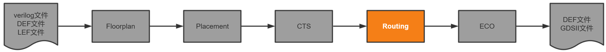
布线是继布局和时钟树综合之后的重要物理实施任务，其内容是将分布在芯片核内的模块，标准单元和输入输出接口单元按逻辑关系进行互连，并为满足各种约束条件进行优化。iRT是iEDA 课题组针对布线阶段设计的一款布线器，其内部集成了全局布线和详细布线。

**编写目的**

本文挡将主要介绍iRT工具内部各个模块的作用，数据结构，主要程序流程以及模块间的调用关系。

**目标读者**

使用iRT的用户（标题2之前），iRT的开发者（标题2及之后）。

## 1.1 设计需求和目标

**需求**

在所有线网都连通的情况下，生成没有DRC，LVS等规则违例的布线结果。

**目标**

* 没有连通的线网个数为0
* DRC违例个数为0
* 满足时序约束
* 总线长最短
* 总通孔数最少

## 1.2 使用说明

### 1.2.1 运行环境设置

运行iRT需要文件POWV.dat，POST.dat，slute.txt，请将这些文件与iRT的可执行文件放到同一目录下。

### 1.2.1 配置文件设置

iRT的默认配置文件为irt_default_config.json，需要对里面的路径进行设置才能使用。内部分为总体设置（flow，lef，def等输入输出文件路径）和模块设置（GridManager，ResourceAllocator等内部模块），下面将描述这些字段的作用以及如何进行配置。

* 总体设置

```json
{
    "RT": {
        "flow": [ //iRT集成了GR和DR，可以在flow里控制单独运行GR，单独运行DR或GR-DR集成运行
            "GR",
            "DR"
        ],
        "lef_file_list": [ //lef文件路径，由于iDB的读取机制，tech_lef必须要在第一个
            "<tech_lef_file_path>",
            "<lef_file_path1>",
            "<lef_file_path2>"
        ],
        "def_file": "<def_file_path>", //输入def文件路径
        "guide_file": "<guide_file_path>", //GR输出guide文件路径或DR输入guide文件路径
        "output_def_directory": "<output_def_directory_path>",//DR输出def文件路径
        "temp_directory": "<temp_directory_path>", //临时文件夹路径，主要用于存储运行时临时数据
  
        .............."模块设置"..............

    }
}
```

* 模块设置

  - GridManager

  ```json
        "GridManager": {
            "global_utilization_ratio": 1, //全局利用率
            "layer_utilization_ratio": { //单层利用率
                "METAL1": 0
            },
            "temp_directory": "<temp_directory_path>" //临时文件夹路径
        },
  ```

  - ResourceAllocator

  ```json
        "ResourceAllocator": {
            "number_of_frame_levels": 1, //多层框架级数（暂不可用）
            "initial_penalty_para": 100, //梯度下降算法的初始罚参数
            "penalty_para_drop_rate": 0.8, //梯度下降算法的下降率
            "max_outer_iter_num": 10, //梯度下降算法的外层最大迭代次数
            "max_inner_iter_num": 50, //梯度下降算法的内层最大迭代次数
            "temp_directory": "<temp_directory_path>" //临时文件夹路径
        },
  ```

  - PlaneRouter

  ```json
        "PlaneRouter": {
            "single_enlarge_range": 10, //扩区域布线的单次扩大范围，，GCell为单位
            "max_enlarge_times": 10, //扩区域布线的最大扩大次数
            "max_lut_capicity": 99999, //最大查找表能力（暂不可用）
            "resource_weight": 3, //资源权值权重
            "congestion_weight": 1, //拥塞权值权重
            "temp_directory": "<temp_directory_path>" //临时文件夹路径
        },
  ```

  - LayerAssigner

  ```json
        "LayerAssigner": {
            "max_segment_length": 1, //单次移动的最大线段长度，GCell为单位
            "via_weight": 1, //通孔权值权重
            "congestion_weight": 1, //拥塞权值权重
            "temp_directory": "<temp_directory_path>" //临时文件夹路径
        },
  ```

  - TrackAssigner

  ```json
        "TrackAssigner": {
            "adjacent_segment_ratio": 0.1, //同线网权重
            "connect_pin_ratio": 1, //同线网Pin的权重
            "pin_obs_ratio": 0.5, //其他线网Pin权重
            "pa_cost": 0.5, //同线网AP点权重
            "overlap_ratio": 100, //重叠权重
            "drc_ratio": 10000, //DRC权重
            "temp_directory": "<temp_directory_path>" //临时文件夹路径
        },
  ```

  - RegionRouter

  ```json
        "RegionRouter": {
            "routing_size": 1,//绕线基本Gcell单位
            "gcell_size": 6560,//Gcell大小
            "grid_cost": 1,//cost_map中格点cost值
            "around_cost": 50,//cost_map中某点扩散的cost值
            "via_cost": 20,//cost_map中打下Via的cost值
            "drc_cost": 100,//cost_map中发生DRC的cost值
            "temp_directory": "<temp_directory_path>" //临时文件夹路径
        },
  ```

  - SpaceRouter

  ```json
        "SpaceRouter": {
            "routing_size": 1,//绕线基本Gcell单位
            "gcell_size": 6150,//Gcell大小
            "temp_directory": "<temp_directory_path>" //临时文件夹路径
        },
  ```

  - ExternalInteractor

  ```json
        "ExternalInteractor": {
            "sta_workspace": "<sta_workspace_path>", //iSTA的工作路径
            "sdc_file": "<sdc_file_path>", //sdc的文件路径
            "lib_file_list": [ //时序lib的文件路径
                "<lib_file_path1>", 
                "<lib_file_path2>",
                "<lib_file_path3>"
            ],
            "temp_directory": "<temp_directory_path>" //临时文件夹路径
        }
  ```
* 程序运行：编译iRT后将产生可执行文件run_rt，需要通过以下方式启动。

```shell
run_rt <irt_config_path>
```

## 1.3 参考文档

### 1.3.1 全局布线

[1][GR拆解文档](https://ieda.yuque.com/kzqyb5/tga6ng/8274755)
[2]FastRoute: An efficient and high-quality global router
[3]CUGR: Detailed-routability-driven 3D global routing with probabilistic resource model.
[4]FLUTE: Fast lookup table based rectilinear steiner minimal tree algorithm for VLSI design

### 1.3.2 详细布线

[1][DR开发文档](https://ieda.yuque.com/kzqyb5/no8a7o/sdxppp)
[2]Negotiation-Based Track Assignment Considering Local Nets
[3]TritonRoute-WXL: The Open-Source Router With Integrated DRC Engine
[4]TritonRoute: The Open-Source Detailed Router
[5]Dr. CU: Detailed Routing by Sparse Grid Graph and Minimum-Area-Captured Path Search

- **专有名词**

| **名词（缩写）**         | **定义（中文名，解释或包含的属性，作用）**                          |
| ------------------------------ | ------------------------------------------------------------------------- |
| Global Routing (GR)            | 全局布线                                                                  |
| Detail Routing (DR)            | 详细布线                                                                  |
| Pin Access (PA)                | PinAccess模块名，也可指代AP点                                              |
| Access Point (AP)              | Pin上的可接入点，包含x-y坐标，一般作为布线的起点或终点                     |
| Region Ripup & Rerouting (RRR) | 区域拆线重布                                                              |


# 2. 整体设计

## 2.1 总体架构

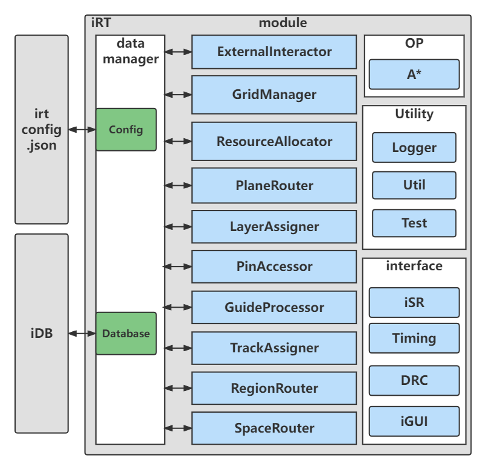

* irt_config.json：iRT配置文件
* iDB：顶层数据来源
* data_manager：iRT的数据管理模块，主要管理Database和Config
* Config：Config类，用于存储iRT配置（包括子模块配置）
* Database：用于存储iRT需要的所有数据（包括但不限于Die，Layer，Net等）
* ExternalInteractor：外部接口类，用于iRT与外部工具交互
* OP：算子库，存储算法（如A*，ILP等）
* Utility：公共库，存储日志工具，工具类，测试类等
* interface：与外部交互的工具

- **全局布线模块**
  * GridManager：网格管理器，用于管理被GCell划分的网格
  * ResourceAllocator：资源分配器，用于在布线前给线网分配资源
  * PlaneRouter：平面绕线器，用于生成线网的二维布线结果
  * LayerAssigner：层分配器，将二维布线结果分配到三维
- **详细布线模块**
  * PinAccessor：pin接入器，在pin上找到详细布线可以接入的点
  * GuideProcessor：guide处理器，用于处理全局布线结果guide
  * RegionManager：区域管理器，用于存储绕线层以上的所有金属
  * TrackAssignment：对Net的区域生成Seg，并且对每条seg分配track，要求避障，最小化重
  * RegionRouter：从第二层开始每两层进行绕线，获得绕线初始解
  * SpaceRouter：对指定区域中的线网或者指定线网进行空间绕线获得最终解

## 2.2 总体流程

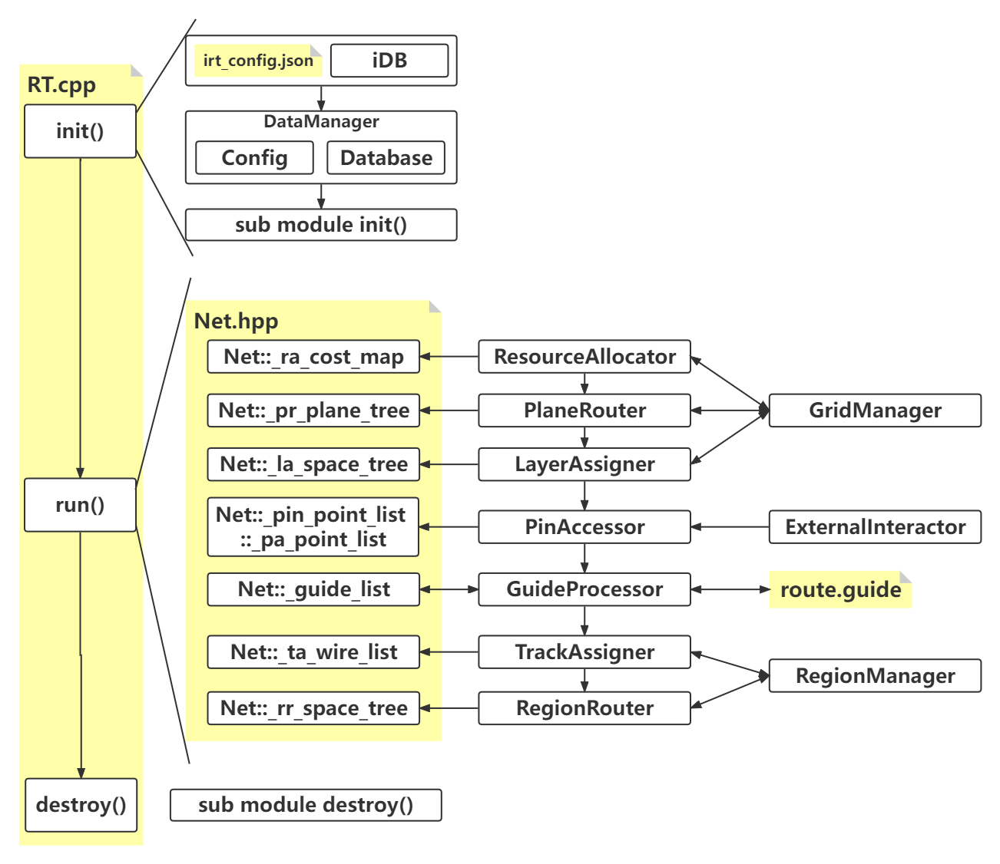

* init()：用于初始化iRT的Config，Database和各个子模块。
```cpp
void RT::init(std::string& rt_config_path, PCL::iDB::IdbBuilder* idb_builder)
{
  double start, end;
  start = COMUtil::microtime();

  printLogo();
  _data_manager.input(rt_config_path, idb_builder);

  Config* config = &_data_manager.getConfig();
  Database* database = &_data_manager.getDatabase();

  GridManager::getInst(config, database);
  TopoGenerator::getInst(config, database);
  ResourceAllocator::getInst(config, database);
  PlaneRouter::getInst(config, database);
  LayerAssigner::getInst(config, database);
  ExternalInteractor::getInst(config, database);
  PinAccessor::getInst(config, database);
  GuideProcessor::getInst(config, database);
  TrackAssigner::getInst(config, database);

  end = COMUtil::microtime();
  Logger::info("RT", "Total initialization time: ", (end - start), "s");
}
```
* run()：iRT的主要流程，里面多个模块在作用，模块的输入为iRT顶层数据，输出通常是Net数据结构内的某个数据。
```cpp=
void RT::run()
{
  double start, end;
  start = COMUtil::microtime();

  Config* config = &_data_manager.getConfig();
  Database* database = &_data_manager.getDatabase();
  std::vector<Net>& net_list = _data_manager.getDatabase().get_net_list();

  ResourceAllocator::getInst().allocate(net_list);
  PrioritySorter::getInst().sort(SortType::kBBoxHPWL, net_list);

  irt_int batch_size = COMUtil::getBatchSize(net_list.size());

  for (size_t i = 0; i < net_list.size(); i++) {
    Net& net = net_list[i];
    PlaneRouter::getInst().route(net);
    LayerAssigner::getInst().assign(net);
    if ((i + 1) % batch_size == 0) {
      GridManager::getInst().checkResourceMap();
      Logger::info("RT", "Processed ", (i + 1), " nets");
    }
  }

  GridManager::getInst().checkResourceMap();
  Logger::info("RT", "Processed ", net_list.size(), " nets(total)");

  GridManager::getInst().printPlaneResourceMap();
  GridManager::getInst().printSpaceResourceMap();
  GridManager::getInst().reportResourceMap();

  _data_manager.outputGuide();
  // sort net_idx
  sortNetIdx(net_list);
  // ExternalInteractor::getInst().reportTiming(_data_manager.getAuxInfo().get_idb_builder(), net_list);

  ExternalInteractor::getInst().initPAPoint(_data_manager.getAuxInfo().get_idb_builder());

  PinAccessor::getInst().access(net_list);
  PinAccessor& pin_accessor = PinAccessor::getInst();
  pin_accessor.access(net_list);
  PinAccessor::delInst();
  // Guide
  GuideProcessor::getInst().processorGuide(net_list);
  GuideProcessor::delInst();
  // TA
  AssignTrackType ta_type = AssignTrackType::kGreddy;
#ifdef BUILD_GUROBI
  ta_type = AssignTrackType::kILP;
#endif
  TrackAssigner::getInst().assignTrack(net_list, ta_type);
  TrackAssigner::delInst();
  // _data_manager.output(NetProcessStage::kTrackAssigner);
  // RR
  // _drc = _db_wrapper->get_drc();

  // _data_manager.output(NetProcessStage::kTrackAssigner);
  // RR
  // _drc = _db_wrapper->get_drc();

  ExternalInteractor::getInst().initDRC(_data_manager.getAuxInfo().get_idb_builder());
  // ExternalInteractor::getInst().checkDRC({1, 2}, region, dr_node_list);
  RegionRouter& region_router = RegionRouter::getInst(config, database);
  region_router.debugWriteGdsForNet();
  region_router.topoBuilder();
  region_router.areaRouter();
  _data_manager.outputDef(NetProcessStage::kRegionRouter);

  end = COMUtil::microtime();
  Logger::info("RT", "Total run time: ", (end - start), "s");
}
```
* destroy()：用于销毁模块和iRT，防止内存泄露。
```cpp
void RT::destroy()
{
  RegionManager::delInst();
  GridManager::delInst();
  TopoGenerator::delInst();
  ResourceAllocator::delInst();
  PlaneRouter::delInst();
  LayerAssigner::delInst();
  GuideProcessor::delInst();
  TrackAssigner::delInst();
  RegionRouter::delInst();
  SpaceRouter::delInst();
  ExternalInteractor::delInst();
}
```
## 2.3 数据结构设计

### 2.3.1 Coordinate.hpp

平面坐标，模板类。
```cpp
  T _x = -1;
  T _y = -1;
```

### 2.3.2 Direction.hpp

二维方向，用于标识线的方向，有以下三种状态(横，竖，斜)。
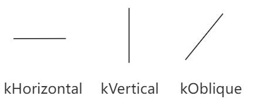
```cpp
  kNone = 0,
  kHorizontal = 1,
  kVertical = 2,
  kOblique = 3
```

### 2.3.3 GridMap.hpp

网格图，模板类，可自定义网格内存放的数据，其中坐标轴如下所示，原点在左下角。
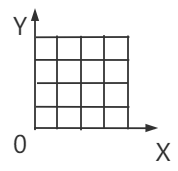
```cpp
  void init(irt_int x_size, irt_int y_size); // 初始化GridMap
  void init(irt_int x_size, irt_int y_size, T value); // 设定初值后初始化GridMap
  void free(); // 释放GridMap
  bool isEmpty() const; // GridMap是否为空
  bool inScope(irt_int x, irt_int y) const; // 坐标(x,y)是否在GridMap内
  std::vector<typename std::result_of<FUNC(T&&)>::type> forEachGrid(FUNC&& func); // 遍历GridMap
```
### 2.3.4 MTree.hpp

多叉树，模板类，可自定义多叉树节点（TNode.hpp）存放的数据。

```cpp=
  // 拷贝一棵树
  static MTree<T> copyTree(MTree<T>& old_tree);
  static TNode<T>* copyTree(TNode<T>* old_root);

  // 释放一棵树
  static void freeTree(MTree<T>& old_tree);
  static void freeTree(TNode<T>* root);

  // 将MTree<T>通过函数"U convert（T）"转换为MTree<U>
  static MTree<U> convertTree(MTree<T>& old_tree, const std::function<U(T&, Args&...)>& convert, Args&... args);
  static TNode<U>* convertTree(TNode<T>* old_root, const std::function<U(T&, Args&...)>& convert, Args&... args);

  // 层序遍历，返回每一层的节点，返回值[0]为根节点
  static std::vector<std::vector<TNode<T>*>> getlevelOrder(MTree<T>& tree, irt_int max_level = -1);
  static std::vector<std::vector<TNode<T>*>> getlevelOrder(TNode<T>* root, irt_int max_level = -1);

  // 查找深度是否超过max_level
  static bool isDeeperThan(MTree<T>& tree, irt_int max_level);
  static bool isDeeperThan(TNode<T>* root, irt_int max_level);

  // 将树分解为多个线段
  static std::vector<Segment<TNode<T>*>> getSegListByTree(MTree<T>& tree);
  static std::vector<Segment<TNode<T>*>> getSegListByTree(TNode<T>* root);
  
// 将多个线段组合成树
  static MTree<T> getTreeBySegList(std::vector<Segment<T>>& segment_list);
  static MTree<T> getTreeBySegList(T& root_value, std::vector<Segment<T>>& segment_list);
```
对于函数getSegListByTree和getTreeBySegList做出补充解释。
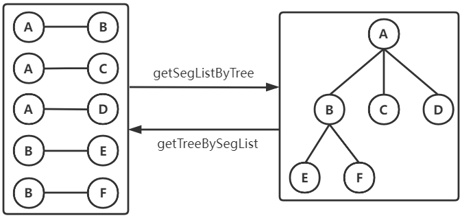

### 2.3.5 Orientation.hpp

二维指向，与Direction.hpp不同，指向分为以下四种状态。

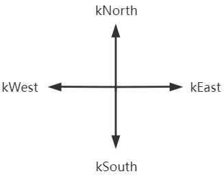

```cpp=
  kNone = 0,
  kEast = 1,
  kWest = 2,
  kSouth = 3,
  kNorth = 4
```

### 2.3.6 Rectangle.hpp

描述一个矩形，面向坐标的模板


```cpp=
  Coordinate<T> _lb;
  Coordinate<T> _rt;

  T getLength() const; // 获得矩形的长
  T getWidth() const; // 获得矩形的宽
  T getHalfPerimeter() const; // 获得矩形的半周长
  T getPerimeter() const; // 获得矩形的周长
  T getArea() const; // 获得矩形的面积
  std::vector<Segment<Coordinate<T>>> getEdgeList();// 获得矩形的四条边
  Coordinate<T> getMidPoint() const;// 获得矩形的中点
  bool isCoordOnRTEdge(Coordinate<T> coord) const;// 点在矩形的右边或者上边
  bool isCoordOnEdge(Coordinate<T> coord) const;// 点在矩形的边上
```

### 2.3.7 Segment.hpp 

描述一个线段，模板类，线段节点为模板

```cpp=
// 以下四个函数只支持当坐标为模板时
struct sortSegmentInnerXASC; // 线段内按X升序排列节点
struct sortSegmentInnerYASC; // 线段内按Y升序排列节点
struct CmpSegmentXASC; // 按每条线段内第一个节点的X升序 线段间排列
struct CmpSegmentYASC; // 按每条线段内第一个节点的Y升序 线段间排列
```

### 2.3.8 TNode.hpp 
树节点，模板类，与MTree.hpp一同使用。
```cpp=
  T _v;// 当前存储的数据
  std::vector<TNode<T>*> _child_list;// 节点的孩子

  irt_int getBranchNum(); // 查看当前节点分支个数（或者孩子个数）
  bool isLeafNode(); // 当前节点是否为叶子节点
  void addChild(TNode<T>* child); // 为当前节点添加一个孩子
  void addChildren(const std::vector<TNode<T>*>& child_list); // 为当前节点添加多个孩子
  void delChild(TNode<T>* child); // 删除当前节点的一个孩子
  void delChildren(const std::vector<TNode<T>*>& child_list);// 删除当前节点的多个孩子
  void clearChildren(); // 清除当前节点的所有孩子
```

### 2.3.9 Blockage.hpp 
在iRT内，Blockage表示为RoutingBlockage，其带有形状（EXTRectangle），层信息以及对应的类型，这里的类型主要从“来源”的角度进行区分。

```cpp=
  EXTRectangle _shape; // 二维形状
  irt_int _layer_idx = -1; // 布线层id
  BlockageType _type = BlockageType::kNone; // Blockage来源类型
```

### 2.3.10 BlockageType.hpp 


```cpp=
  kNone = 0,
  kArtificial = 1, // 在def内描述，由工程师在版图上添加的blockage
  kInstance = 2, // 由于多层instance的结构阻挡了布线层，所以被作为布线blockage
  kSpecialNet = 3 // 高层的电源线，阻挡布线层，被作为布线blockage
```

### 2.3.11 Config.hpp 

iRT配置，其中包括对iRT顶层的配置和对各个子模块的配置，配置来源是irt_config.json。

```cpp=
  // RT
  std::vector<std::string> _flow; // 流控制，可以控制单跑GR或DR，或者联合run
  std::vector<std::string> _lef_file_path_list; // lef文件路径，由于iDB的读取机制，tech_lef必须要在第一个
  std::string _def_file_path; // 输入def文件路径
  std::string _guide_file_path; // GR输出guide文件路径或DR输入guide文件路径
  std::string _output_def_file_path; // DR输出def文件路径
  std::string _temp_directory_path; // 临时文件夹路径，主要用于存储运行时临时数据
  // RT ExternalInteractor
  EIConfig _ei_config; // ExternalInteractor配置
  // RT GridManager
  GMConfig _gm_config; // GridManager配置
  // RT GuideProcessor
  GPConfig _gp_config; // GuideProcessor配置
  // RT LayerAssigner
  LAConfig _la_config; // LayerAssigner配置
  // RT PinAccessor
  PAConfig _pa_config; // PinAccessor配置
  // RT PlaneRouter
  PRConfig _pr_config; // PlaneRouter配置
  // RT RegionManager
  RMConfig _rm_config; // RegionManager配置
  // RT RegionRouter
  RRConfig _rr_config; // RegionRouter配置
  // RT ResourceAllocator
  RAConfig _ra_config; // ResourceAllocator配置
  // RT SpaceRouter
  SRConfig _sr_config; // SpaceRouter配置
  // RT TopoGenerator
  TGConfig _tg_config; // TopoGenerator配置
  // RT TrackAssigner
  TAConfig _ta_config; // TrackAssigner配置
```

### 2.3.12 CutLayer.hpp 

设计中除了RoutingLayer外，还有CutLayer，CutLayer主要用于放置Via。

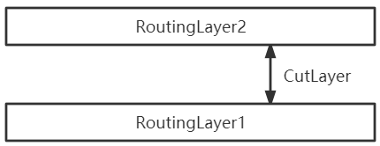

```cpp=
  irt_int _layer_idx = -1; // cut层id
  std::string _layer_name; // cut层名字
  std::vector<Spacing> _spacing_list; // 生成通孔的spacing规则
```

### 2.3.13 DRNode.hpp 
DetailRouting里面使用的节点（可能为Wire Or Via）
```cpp=
  irt_int _net_idx = -1;
  DRNodeType _type = DRNodeType::kNone;
  DRNodeCategory _category = DRNodeCategory::kNone;
  WireNode _wire_node;
  ViaNode _via_node;
```
    
### 2.3.14 DRNodeCategory.hpp 
```cpp=
enum class DRNodeCategory
{
  kNone = -1,  
  kTA = 0,        //TA阶段产生的线
  kRouting = 1,  //后续绕线新增的线
  kForce = 2,   //强制绕线
  kMinArea =3  //最小面积补充的线
};
```
### 2.3.15 DRNodeType.hpp 
```cpp=
enum class DRNodeType
{
  kNone = 0,
  kWire = 1,
  kVia = 2
};
```
### 2.3.16 Database.hpp 
顶层的数据类，包含所有的模块通用数据
```cpp=
 private:
  EXTRectangle _die;        //芯片面积大小
  GCellAxis _gcell_axis;    //GR中 Gcell的划分
  std::vector<Via> _via_lib; //通孔库
  std::vector<RoutingLayer> _routing_layer_list; //绕线层
  std::vector<CutLayer> _cut_layer_list;  //CUT层一般是用于连接金属层的
  std::vector<Blockage> _blockage_list;  //障碍物集合
  std::vector<Net> _net_list;            //线网集合
  // temp,wait congetion
  std::map<irt_int, std::set<irt_int>> _region_net_connect; //计算拥塞的？
```

### 2.3.17 EXTRectangle.hpp 
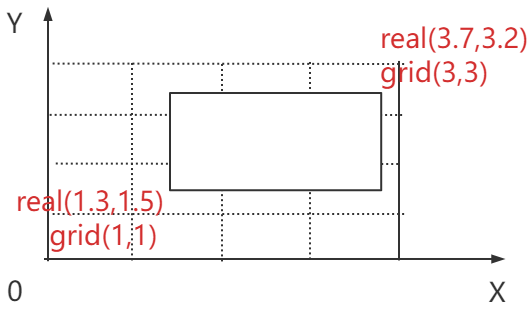

```cpp=
 private:
  Rectangle<irt_int> _grid; // 缩放的gcell矩形，以gcell为标准基数
  Rectangle<irt_int> _real; // 真实的版图坐标矩形
```

### 2.3.18 Enclosure.hpp 
通孔VIA的上下帽子的数据结构，形状包括水平 垂直
```cpp=
 private:
  Rectangle<irt_int> _shape;   
  irt_int _layer_idx = -1;
  Direction _direction = Direction::kNone;
```

### 2.3.19 GCellAxis.hpp 
同一维度上的GCellGrid头尾相连即为GCellAxis。
```cpp=
 private:
  std::vector<GCellGrid> _x_grid_list;
  std::vector<GCellGrid> _y_grid_list;
```

### 2.3.20 GCellGrid.hpp 

下图中，第一条语句中的“1100”为_start_line，“2”为（_step_num+1），“50”为_step_length，_end_line = _start_line+（_step_length*_step_num）。
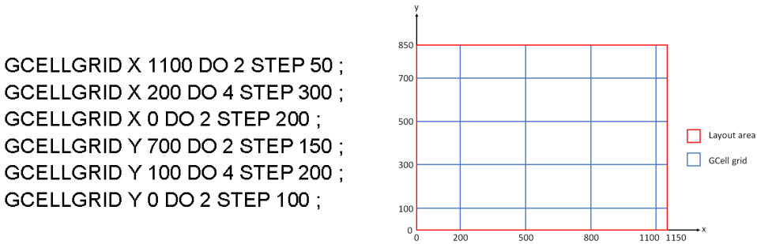

```cpp=
 private:
  irt_int _start_line = 0;     // 起始位置
  irt_int _step_length = 0;   // 步长
  irt_int _step_num = 0;     // 步数
  irt_int _end_line = 0;    // 结束位置
```

### 2.3.21 GRNode.hpp 
GR的结点
```cpp=
 private:
  // self
  Coordinate<irt_int> _grid_coord;  //格点坐标
  irt_int _layer_idx = -1; // 布线层id
  // ref
  std::vector<irt_int> _pin_point_idx_list;  //包含那些Pin
```

### 2.3.22 Guide.hpp

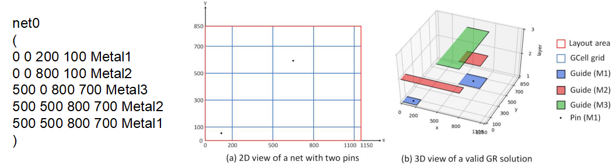

1、保存GR计算的结果，作为TrackAssign输入数据
2、在RegionRouter模块，保存已有的布线结果，作为建立rrouter的rtree和设置障碍依据。

```cpp=
irt_int _layer_idx = -1;
Rectangle<irt_int> _real_shape;
```


### 2.3.23 IOType.hpp 

引脚的输入输出类型

```cpp
kNone = 0,
kInput = 1,
kOutput = 2,
kInOut = 3,
kFeedthru = 4
```

### 2.3.24 Net.hpp

线网类，保存线网信息，所有的模块的结果会对应地写入这里

```cpp
  irt_int _net_idx = -1; // 线网id
  std::string _net_name; // 线网名字
  SigType _sig_type = SigType::kNone; // 线网信号类型（Signal，Clock等）
  std::vector<Pin> _pin_list; // pin列表
  Pin _driving_pin; // 驱动pin，一个线网只有一个驱动pin
  EXTRectangle _bounding_box; // 线网所有pin的外接矩形
  std::vector<PinPoint> _pin_point_list; // pin对应在RT内的数据结构
  PinPoint _driving_pin_point;// 驱动pin对应在RT内的数据结构
  irt_int _min_layer_cstr = -1; // 这个线网的最低布线层
  // PrioritySorter
  double _priority = 0; // 线网优先级
  // ResourceAllocator
  GridMap<double> _ra_cost_map; // ResourceAllocator的结果，以权值图体现
  // PlaneRouter
  MTree<GRNode> _pr_plane_tree; // PlaneRouter的结果，以多叉树描述
  // LayerAssigner
  MTree<GRNode> _la_space_tree; // LayerAssigner的结果，以多叉树描述
  // GuideProcessor
  std::vector<Guide> _guide_list; // 此线网的Guide集合
  // TrackAssigner
  std::vector<DRNode> _ta_wire_list; // TrackAssigner的结果，已合理分配但零散的wire
  // RegionRouter
  MTree<DRNode> _rr_space_tree; // RegionRouter的结果，以多叉树描述
```

### 2.3.25 NetProcessStage.hpp 

描述线网在布线过程中，已经到哪一阶段了

```cpp=
kNone,
kTrackAssigner,
kRegionRouter,
kRegionRipUpRouter,
kSpaceRouter,
kSpaceRipUpRouter,
kMax
```

### 2.3.26 PAPoint.hpp

Wire连接Pin的连接点

```cpp=
irt_int _layer_idx = -1;            // pa点所在的层信息
Coordinate<irt_int> _real_coord;    // pa点的绝对坐标
PAPointType _type = PAPointType::KNone;        // pa点的类型
std::vector<irt_int> _optional_via_idx_list;   // pa候选via在via_lib中的下标
```

### 2.3.27 PAPointType.hpp 

PAPoint的类型

```cpp=
KNone = 0,    // 未初始化类型
kOnGrid = 1,  // pa点在track交点上
kOnTrack = 2, // pa点在pin shape内部track的中间点上
kCenter = 3,  // pa点在pin shape的中心点上
kOffset = 4   // pa点是经过偏移之后的点
```

### 2.3.28 PinPoint.hpp 

Pin在RT内的数据结构

```cpp
// self
irt_int _pin_point_idx = -1;      // 当前PinPoint对应的id
Coordinate<irt_int> _real_coord;  // pin点的绝对坐标
Coordinate<irt_int> _grid_coord;  // pin点在grid_map中的相对坐标
std::vector<irt_int> _layer_idx_list;    // pin所跨的层信息
std::vector<PAPoint> _pa_point_list;     // pin上的pa列表
// ref
irt_int _pin_idx = -1;                   //当前PinPoint对应的Pin的id
```

### 2.3.29 Port.hpp 

保存pin shape信息，当pin跨多层时，每层的pin shape对应一个Port

```cpp
irt_int _layer_idx = -1;    
std::vector<Rectangle<irt_int>> _shape_list;

Rectangle<irt_int> box_rect();    // shape_list对应的boundingBox矩形
```

### 2.3.30 RTU.hpp 

iRT模块自定义的整型类型，为了增加数据的表示范围，选择32为整型

```cpp
using irt_int = int32_t;
#define IRT_INT_MIN INT32_MIN;
#define IRT_INT_MAX INT32_MAX;
```

### 2.3.31 RoutingLayer.hpp 

绕线层的属性信息

```cpp
irt_int _layer_idx;      // 布线层id
std::string _layer_name; // 层名
Direction _direction;    // 优先走线方向，见2.3.2
irt_int _min_width;      // 金属的最小工艺宽度
irt_int _min_area;       // 金属的最小工艺面积
RoutingTrack _routing_track;           // 绕线轨道属性，见2.3.32
std::vector<Spacing> _spacing_list;    // 当前布线层的间距规则
```

### 2.3.32 RoutingTrack.hpp 

绕线轨道

### 2.3.33 SigType.hpp 

Net的信号类型

```cpp
kNone = 0,
kSignal = 1,
kPower = 2,
kGround = 3,
kClock = 4,
kAnalog = 5,
kReset = 6,
kScan = 7,
kTieoff = 8
```

### 2.3.34 Spacing.hpp 

DRC 用语

### 2.3.35 Via.hpp 

```cpp
irt_int _via_idx;
std::string _via_name;
Enclosure _above_enclosure;
Enclosure _below_enclosure;
```

### 2.3.36 ViaNode.hpp 

```cpp
irt_int _id;
irt_int _via_idx;
irt_int _above_layer_idx;
irt_int _below_layer_idx;
Coordinate<irt_int> _real_coord;
```

### 2.3.37 WireNode.hpp 

```cpp
irt_int _id;
irt_int _layer_idx;
irt_int _width;
Coordinate<irt_int> _first;
Coordinate<irt_int> _second;
WireNodeType _type;
```

### 2.3.38 WireNodeType.hpp 

```cpp
kNone = 0,
kRouting = 1,
kMinAreaPatch = 2,
```

## 2.4 子模块设计

所有子模块的架构与下图一致


### 2.4.1 ExternalInteractor

* 功能描述
  * 构建网格模型
  * 初始化网格资源
  * 计算障碍物对网格的影响
* 数据结构

* 算法设计
  
* 评价指标

* 外部接口
 

### 2.4.2 GridManager

* 功能描述
  * 构建网格模型
  * 初始化网格资源
  * 计算障碍物对网格的影响
* 数据结构

* 算法设计
* 评价指标

* 外部接口


### 2.4.3 ResourceAllocator

* 功能描述
  * 估计线网需求
  * 构建迭代模型
  * 使用梯度下降求解资源分配
  * 将资源图转换为资源代价图

* 流程图

* 数据结构

* 算法设计
* 评价指标

* 外部接口

### 2.4.4 PlaneRouter

* 功能描述
  * 通过iSR生成线网拓扑
  * 对拓扑解构进行两点布线
  * 对所有两点布线进行以下算法
    - L型布线
    - Z型布线
    - 内部三拐弯布线
    - 动态模式布线
    - U型布线
    - 外部三拐弯布线
    - A*布线

* 流程图

* 数据结构

* 算法设计
* 评价指标

* 外部接口

### 2.4.5 LayerAssigner

* 功能描述
  * 构建层分配树
  * 从层分配树根节点传播通孔数量
  * 从树叶子节点回溯通孔数量（动态规划）
  * 构建三维树

* 流程图

* 数据结构

* 算法设计
* 评价指标

* 外部接口

### 2.4.6 PinAccessor

* 功能描述
  * 计算 pin 的候选 pa 点，进行合法性检查，并获得合法的 via。
  * 计算不同 pin 的候选 pa 点之间的冲突关系。
  * 使用贪婪算法，计算每个 pin 最优的 pa 点。
  * 针对非 onGrid 类型的 pa 点生成 Jog。

* 流程图<br/>
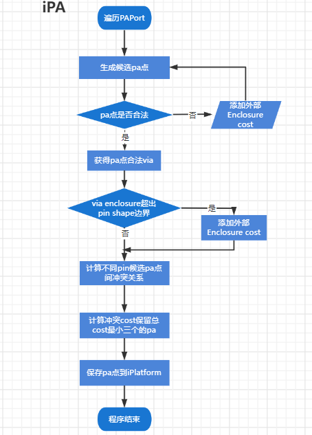

* 数据结构

* 算法设计
  > 贪心算法：

  ```
  Input: Panel panel,  optimal PAPoint vector opt_pa_point_List

  get PAPort vector pa_port_list by panel 
  sort pa_port by non-increasing of pa'number
  Foreach pa_port in pa_port_list:
      opt_pa_point;
      min_conflict_cost = MAX_value;
      Foreach pa_point in pa_point_list:
    curr_conflict_cost = 0;
    curr_conflict_cost = calConflictWithPaOfOptPaPointList();
    if (min_conflict_cost > curr_conflict_cost) then
      min_conflict_cost = curr_conflict_cost;
      opt_pa_point = pa_point;
    end if
      end foreach
      sort pa_point_list by ascending order of total-cost
      insert opt_pa_point insert opt_pa_point
  end foreach
  ```
* 评价指标

* 外部接口
  
### 2.4.7 GuideProcessor

* 功能描述
  - 对GR的Guide进行处理
    - 按Pin的位置进行切割
    - 去重

* 流程图<br/>
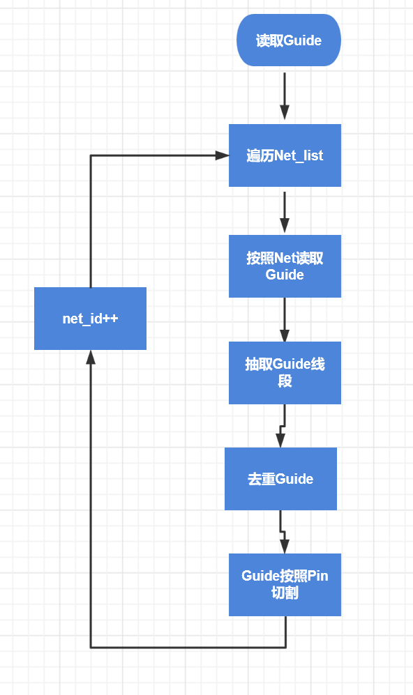
* 数据结构

* 算法设计
* 评价指标

* 外部接口
  
### 2.4.8 RegionManager

* 功能描述
  - 首先初始化用Rtree保存所有的Block和Pin作为静态数据
    - block采用DRC膨胀+融合
    - 需要的时候在拆分
  - 建立RModel，统一以RModel数据处理
  - 加入或者消除Wire或者Via的时候，转为RModel
  - 给定层和区域可以通过boost库快速获取相交的所有物体
* 流程图

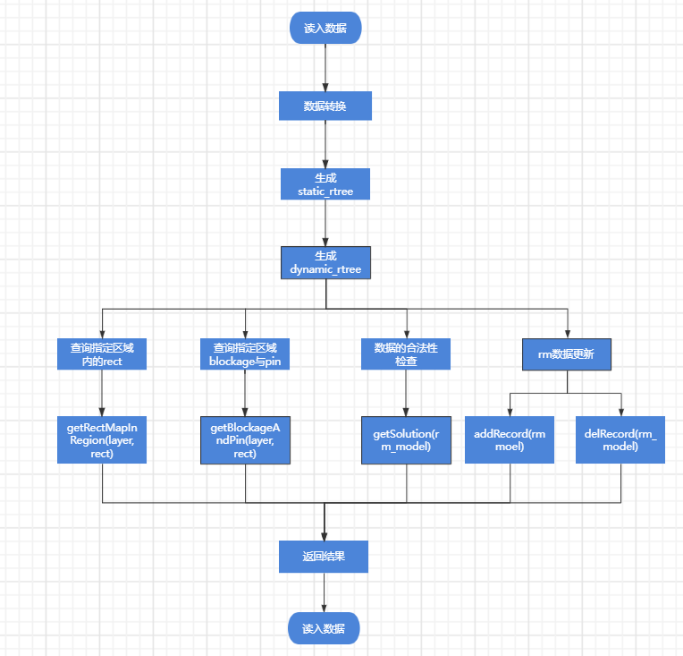

* 数据结构

* 算法设计
* 评价指标

* 外部接口
  
### 2.4.9 TrackAssignment

* 功能描述
  - 遍历所有Net,判断是否为Local_net，如果是的话按照HV或者SR生成主干线段
  - 抽取Guide线段,如果一个区域包含多pin，生成局部local net主干线段
  - 上述线段存入对应Panel
  - 开始TA，首先进行ILP，如果ILP超时或者无解，采用贪心算法
  - 结果进行合并去重，写回NET

* 流程图<br/>

  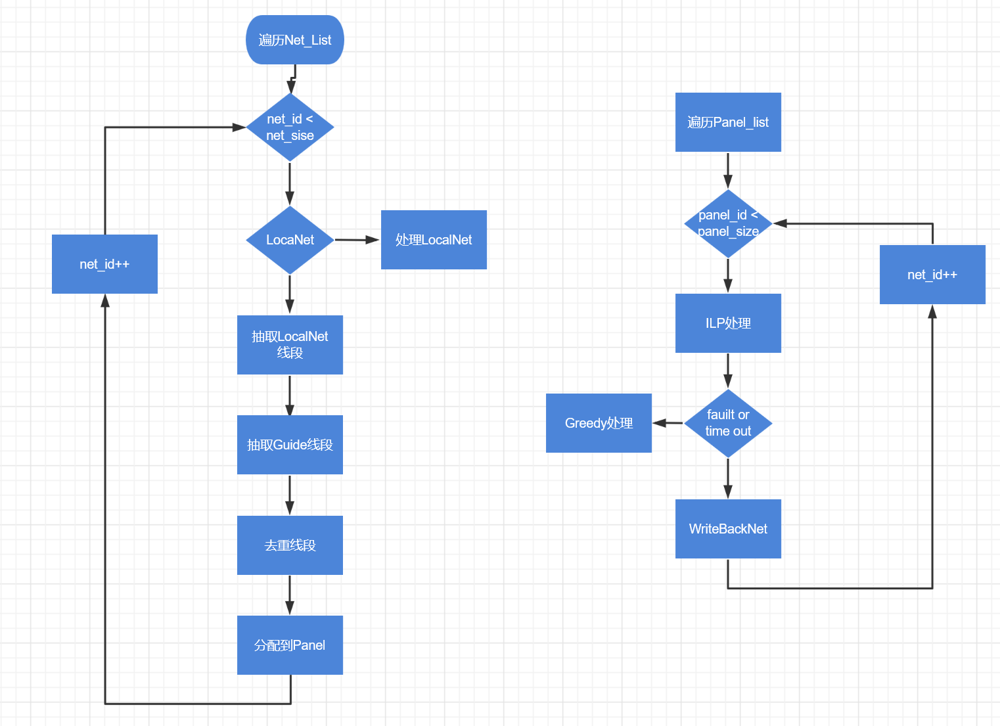

* 数据结构

* 算法设计

  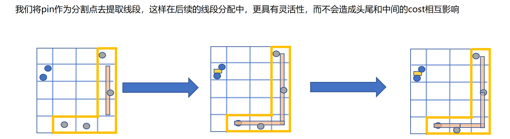

  ```cpp
  ### AssignTrack的时候采用Greedy
  贪心：
    Input：Panel p,seg set S(p),and track set T(p)
    Sort S(p) based on their lengths in a non-increasing ordere
    Foreach seg in S(p) traversed by their sorted order
      minCost = +00
      Foreach track t in T(p)
        wlCost = calculateWirelengthCost(seg,t)
              paCost = calculatePaCost(seg,t)
        otherPaCost = calculateOtherPaCost(seg,t)
        overlapCost = calculateOverlapCost(seg,t)
        blockCost = calculateBlocakgeCost(seg,t)
        Cost = wlCost*α +paCost  *j + otherPaCost * m + overlapCost*β+ blockCost*k
        If(cost < minCost) then
          minCost = cost
                minCostTrack = t
              End if
            End foreach
            Assign seg to minCostTrack
    End foreach
    函数解释
    calculateWirelengthCost(seg,t)暂时可以不加这个cost
    calculatePaWireLengthCost(seg,t)
        seg想和同类型的pa近，算的是seg终点和pa点的二维距离，这部分数据需要预处理一下
    calculateOtherPaCost(seg,t)
        如果seg的矩形和panel的pa_tree矩形存在相交且不是本类型，增加cost,如果是本类型的减少cost,cost算的是重叠长度
    calculateOverlapCost(seg,t)
        如果seg的矩形和panel的seg_tree矩形存在相交且不是本类型，增加cost
    calculateBlocakgeCost(seg,t)
        如果seg的矩形和panel的block_tree矩形存在相交，增加cost，算的是重叠长度大小
    目前α为0.5 ，j为1，m为 50 ，β为100，k为10000
  ```
* 评价指标

* 外部接口
  
### 2.4.10 RegionRouter

* 功能描述
  - 首先生成区域拓扑
    - 遍历Grid区域生成All Layer Router，从 `RRouterLayerList` 中获得拓扑数据存储的位置
    - 遍历Router中的每条subnet：
      - 获得Key Point
      - 根据Key Point，调用SR获得坐标间的拓扑关系
      - 斯坦纳点分配层信息
      - 为跨层的点生成Via
  - 从第二层开始,每两层开始绕线
    - 按区域遍历
      - 建立cost_map,RM初始化
      - 获取拓扑数据
      - 绕线
        - 根据当前布线资源，移动将不合法的拓扑点
        - Cost_map更新
        - 模式布线，A*
        - 如果不连通则强制绕线
    - 按区域检测DRC，是否拆线重布
      - 选择Cost的最大Net拆线
      - 反馈Cost给Cost_map
      - 重绕线
      - 迭代若干次后还是不行则按密度扩区域

* 流程图<br/>
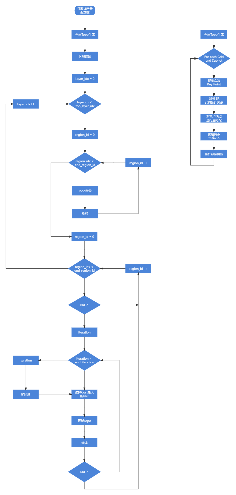
* 数据结构

* 算法设计
    ```cpp
  区域内拆线策略

  拆一个绕一个，迭代可行高，可以消除net顺序的影响
      评价一个net目前绕线的结果好不好，并且做为整体拆线的评估
                  Evil_cost = α*drc_grid_cost + β*vias_cost+ γ*wire_grid_cost,越大越不好
                  drc_grid_cost:drc_cost*drc占据的grid个数，wire_grid_cost：wire占据的grid个数
                  prefer dir为1，no prefer为20，via为30，drc为50
                  α，β，γ的值分别为[1.0-3.0],0.1,1
            
                  待考虑：是否考虑加入一个随机变量让贪心随机一点，不陷入局部优化或者循环 ？ 暂未加入
  ```
* 评价指标

* 外部接口
  
### 2.4.11 SpaceRouter

* 功能描述
  - 按照DRC选择Net目标
  - 扩区域
  - 建立三维图
  - 三维Astart
  - 同RegionRouter拆线迭代策略

* 流程图

* 数据结构

* 算法设计
* 评价指标

* 外部接口

## 3. 接口设计

### 3.1 外部接口

> *包括用户界面、软件接口。*

```c++
idrc::DRC* _drc;
```

（1）初始化DRC

```c++
void initDRC(PCL::iDB::IdbBuilder* idb_builder);
void ExternalInteractor::initDRC(PCL::iDB::IdbBuilder* idb_builder)
{
  _drc = new idrc::DRC();
  _drc->initTechFromIDB(idb_builder);
  _drc->initCheckModule();
}
```

## 4. DEF输出


## 5. TO BE DONE

### 5.1 疑难问题

> *描述重点难点问题* ；
>
> *说明在开发过程中遇到的问题，以及解决方法。例如：方法的选择、参数的处理、需要说明的其他具体问题。如果有不能正常工作的模块，说明具体情况，猜测可能的原因。*

### 5.2 待研究

> *待研究问题；*
