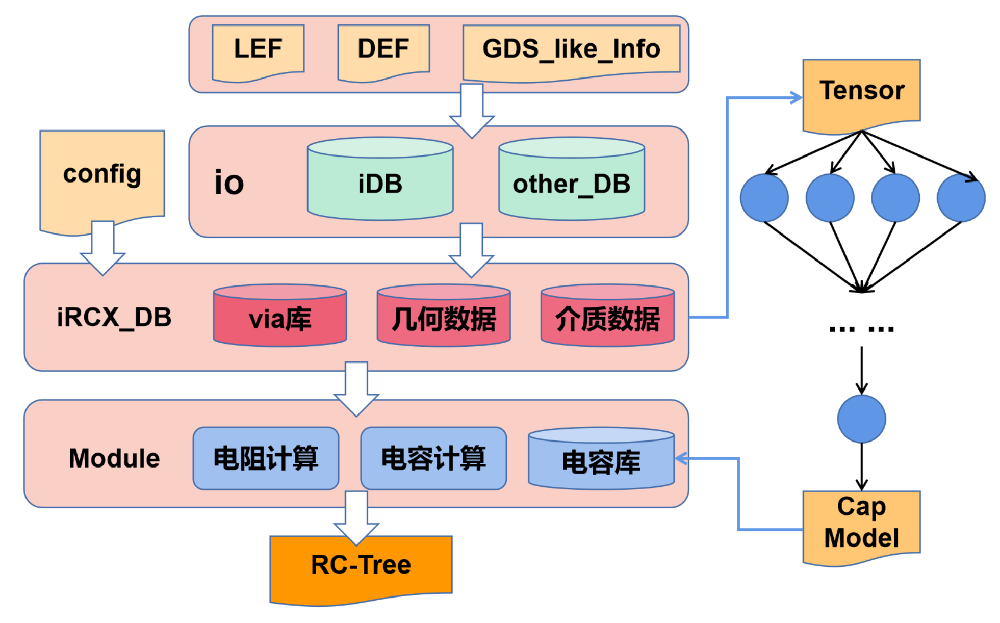
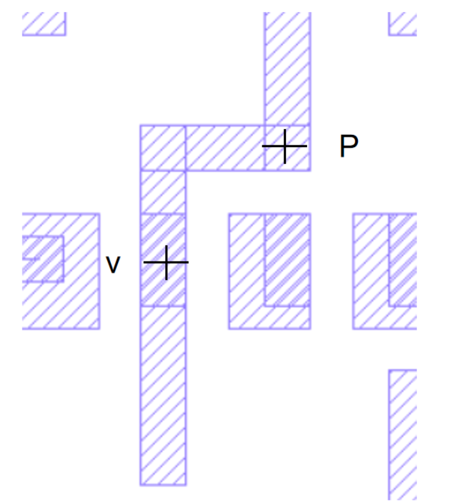
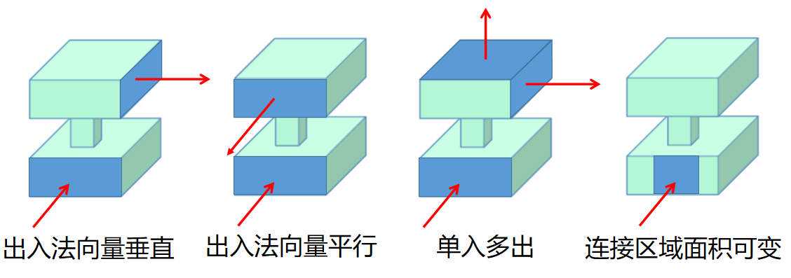

# iRCX - 参数提取

## 1. 简介

> *简要描述设计的背景、编写目的、目标读者等；*

在芯片生产出来之前，我们希望对实际芯片的信号进行仿真测试，那么在电路中影响信号的主要因素就是电容和电阻（甚至电感）。

目标读者：**开发、维护iRCX的人员。**

该手册定义了一套使用iRCX计算方法获取版图寄生参数的流程、数据结构。希望帮助读者迅速理解代码。

### 1.1 设计需求和目标

> *描述需求和目标。*

**电阻计算**

* **两点间电阻计算：** 信号大小受到电路电阻的影响，在给定Net的情况下，RCX需要提供这段Net上某两点的电阻大小。
* **via电阻计算库：** 一个导体电阻取决于电流入面出面的不同情况。而在via部件处，电流高概率改变方向，所以需要通过静电场求解器来计算via附近的测量点电阻。而在VLSI下，许多的via呈现出类似的几何结构，有利于使用相同的计算方式获得目标电阻，减少了运算时间。

**电容计算**

* **两点间互电容及某点对地电容：** 信号的延迟与失真受到电路电容的影响，为了精确仿真，RCX需要提供版图上某点的对地电容，以及某两点间的互电容。
* **模式匹配电容库：** 由于精确计算电容需要的时间开销很大，在VLSI下互连线构成了大量重复的几何空间，互连线所处的空间区域也是由相同的介质构成。因此使用模式匹配进行局部空间的电容求解是可行高效的方案。

### 1.2 专有名词

| **名词（缩写）**                       | **详细定义**                                        |
| -------------------------------------------- | --------------------------------------------------------- |
| Resistance and Capacitance Extraction（RCX） | 寄生电阻电容提取                                          |
| iRCX                                         | iEDA项目下的寄生参数提取模块                              |
| Very Large-Scale Integration(VLSI)           | 超大规模集成电路                                          |
| Library Exchange Format files(LEF)           | Cadence公司设计的文件格式，包含了一类芯片设计的信息       |
| Design Exchange Format file(DEF)             | Cadence公司设计的文件格式，包含了特定芯片和电路的设计信息 |
| Net                                          | 线网，一组相互连接的引脚称为在一个Net上                   |
| Wire                                         | 金属互连线                                                |
| Pin                                          | 元器件和互连线相接处的部分,一般在LEF中由多个长方体组成    |
| Via                                          | 衔接相邻Metal层的连接部件                                 |
| Cut                                          | 两个相邻Metal层之间的连接层，称为cut层                    |
| Segment（Seg）                               | 同一层的金属互连线                                        |
| Window                                       | 包含了几何数据和介质数据的局部空间。详情看                |
| Pattern                                      | 对应局部几何与介质下的电容模型。详情看                    |
| static timing analysis(STA)                  | 静态时序分析：估计每条路径的时延                          |
| iDB                                          | iEDA项目下的通用数据库模块                                |


图1.1 Pin、Via、Segment立体视图

### 1.3 参考文档

[1][喻文健《集成电路寄生参数提取技术》腾讯会议2021.5.31录屏](https://pan.baidu.com/s/10DQSF7WS_ExLv0oGAQ-rjg)

[2][伍盛坤《RC版图处理与建库》](https://ieda.yuque.com/kzqyb5/gqm0qq/26083124)

[3][Cadence 《LEF/DEF 5.8 Language Reference》](https://ieda.yuque.com/kzqyb5/qhfw3z/20900143)

[4][梁宇耀 《3D Routing View》](https://ieda.yuque.com/kzqyb5/gqm0qq/24908608)

### 1.4 使用说明

> *每一个模块*  */*  *核心类*  */* *子程序的功能，需要的参数，截屏*

由于当前未开发配置模块，所以需要修改的参数都在程序源码中。

#### 1.4.1 输入布线后的版图数据

> 由于目前只支持基于iDB解析的LEF/DEF数据，所以请指定所涉及的LEF和**完成布线的DEF**文件路径。
> 具体来说就是确定initDB()函数中的 **lef_files** 和**def_file** 两个变量的值。

```c++
void iDBWrapper::initDB() {
  if (_idb == nullptr) {
    PCL::iDB::IdbBuilder* db_builder=new PCL::iDB::IdbBuilder();
    vector<string> lef_files ({
      "/path/to/LEF/file_1.lef",
      "/path/to/LEF/file_2.lef",
      // ... ...
      "/path/to/LEF/file_n.lef",
    });
    PCL::iDB::IdbLefService* lef_service=db_builder->buildLef(lef_files);
  
    string def_file="/path/to/DEF/file.def";
    PCL::iDB::IdbDefService* def_service=db_builder->buildDef(def_file);
    _idb=db_builder;
  }
}
```

#### 1.4.2 设置最短seg长度

为了提高计算精度和减少计算时间，需要设置segment在参与电阻或电容计算的最大长度。程序会对长的segment进行切分，单位目前设置的是纳米。

> 代码还没写，接口和案例后续补充

#### 1.4.3 设置window框选区域

Window是一个区域，该区域框了一组导线的几何数据、也有每一层的介质数据。用于电容计算和使用电容Pattern的模式匹配。设置参数包括以“主导体”为中心，向上下扩展的层数（单位为层）、x方向扩展的距离（单位为纳米）、y方向扩展的距离（单位为纳米）。

该部分的难度在于给定一个cube, 如何能快速地找到其附近的cube.

> 代码还没写，接口和案例后续补充

## 2. 整体设计

### 2.1 总体架构



图2.1 iRCX总体架构图

* **GDS_like_Info:** 以GDS文件为代表的，可以表示版图设计的文件。*(暂不支持)*
* **config:** 在**1.4节**中应该配置的参数。*（有待开发）*
* **Tensor:** 由**window**生成的张量数据。
* **RC-Tree:** 提供给STA的数据。
* **Cap Model:** 用于全芯片电容模式匹配计算的网络模型。

### 2.2 软件流程

> 描述软件的总体处理流程，**用文字描述清楚整个运行过程，并附上相应的代码**


图2.2 iRCX软件流程图

#### 2.2.0 启动iRCX

```c++
// 方式1：默认启动
iRCX rcx;
// 方式2：带配置启动
iRCX rcx=iRCX("path/to/config");
```

#### 2.2.1 获取版图数据

目前是通过iDB对LEF/DEF文件进行解析，获取版图数据。

```c++
void iRCX::initDB() { 
  if (_db) delete _db;

  std::cout << "According to config, build db, current is iDB\n";
  _db=new iDBWrapper(); // 这里就是对iDB进行的数据适配
  _db->set_db_name();
  _db->set_dbu_per_micron();
}
```

#### 2.2.2 转换为iRCX基础数据类型

在DEF文件中存储一条Net的形式是：

```def
......
- buffer2 CLKBUF_X1 + PLACED ( 20520 154000 ) N ;
......
- req_msg[10] ( PIN req_msg[10] ) ( buffer2 A ) 
  + ROUTED metal3 ( 70 155260 ) ( 20710 155260 )
    NEW metal1 ( 20710 155260 ) via1_4
    NEW metal2 ( 20710 155260 ) via2_5
+ USE SIGNAL ;
```

这里是名为*req_msg[10]* 的信号线在设计时的互连线分布。其中*PIN req_msg[10]* 表示信号输入引脚，*buffer2 A* 表示器件类型为*CLKBUF_X1* 的实例,进行信号接受的一个引脚A，它与*req_msg[10]* 通过这条Net相连。走线包含了metal1，metal2，metal3三层金属走线层，每一层的互连线线段端点和上下层连接也有清晰的描述。以上信息可以形成电路的2.5维走线信息，还需要LEF文件中的线宽、层高、器件图形等信息才可以对走线的立体结构进行建模。

在LEF文件中有类似以下信息：

```lef
......
MACRO CLKBUF_X1
  ......
  PIN A
    DIRECTION INPUT ;
    USE SIGNAL ;
    PORT
      LAYER metal1 ;
        RECT 0.06 0.525 0.21 0.7 ;
    END
......
```

这个是器件类型为*CLKBUF_X1* 的*Pin A* 的平面形状信息；有了类似以上信息就可以获得构成图2.3的数据了。


图2.3 req_msg[10]在klayout的平面局部视图

```lef
......
LAYER metal1
  TYPE ROUTING ;
  WIDTH 0.07 ;
  THICKNESS 0.13 ;
  HEIGHT 0.37 ;
......
```

这里是LEF文件中的metal1层的线宽、层高信息。有了类似这样的信息，就可以获得构成图2.4的数据了。


图2.4 req_msg[10]立体结构透视图（左） 优先级覆盖视图（右）

接下来是从代码层面看这个过程。

```c++
// 所有介质层数据转换的入口
void iDBWrapper::buildLayerDielectricMap();
// 所有wire数据转换的入口
void iDBWrapper::buildConductorList();
```

对于介质数据而言，目前将每一层金属走线层视为同一介电常数的长方体。设置金属走线层（取二氧化硅介电常数3.9）、多晶硅层（取硅介电常数11.5）、芯片上空气层（取空气介电常数1）。另外有一个整芯片层是为了计算电流出入面使用的。

```c++
void iDBWrapper::buildLayerDielectricMap() {
  // routing & cut
  insertBoundaryMetal();
  // masterslice
  insertBoundaryMasterslice();
  // air
  insertBoundaryAir();
  // die  
  insertBoundaryDie();
}
```

对于wire而言，需要将其转换为Conductor类型的数据。Wire从iDB到iRCX_DB的函数流程如下

```c++
void iDBWrapper::buildConductorList() {
  ASSERT(_idb, "Please initialize _idb");
  ASSERT(_net, "Please initialize _net");

  auto net_list=_idb->get_def_service()->get_design()->get_net_list();
  auto layers=_idb->get_def_service()->get_design()->get_layout()->get_layers();
  int pass=0;
  int ignore=0;
  const std::string debug_net_name="";
  for (auto net : net_list->get_net_list()) {
    // to remove some bad synthesized net
    if (net->get_pin_number() <= 1) {
      ++ignore;
      continue;
    } 

    // debug
    if (debug_net_name.compare("")
     && net->get_net_name().compare(debug_net_name)) continue;

    // 2.5D
    _net->parseIDBNet(net, layers);

    // 3D
    _net->buildConductorTree(net, layers, die);
    _net->popConductorList(_conductor_list);

    _net->clearData();
    std::cout << "pass=" << ++pass << "/" << net_list->get_num() << "\n";
  } 
  ASSERT(ignore + pass == net_list->get_num(), "Some net are missing");
  std::cout << "pass=" << pass << ", ignore=" << ignore << std::endl;
}
```

接下来描述一下构建类似于图2.3的效果的通用方式。
iDB读入DEF中的Net是以点的形式组织起来的，直观感受就是图2.5右图所示。需将将LEF的层高信息、表示点的图形源信息添加过后，才能恢复成图2.5左图的形式。


图2.5 2.5D电流树立体图（左） 2.5D树空间散点图（右）

构建2.5D树任务的数据上游是iDB,数据处理的结果要满足将这些点连接成树状结构。函数入口如下。

```c++
void Net::parseIDBNet(PCL::iDB::IdbNet* net, PCL::iDB::IdbLayers* layers) {
  if (!net || !layers) return;
  _net_name=net->get_net_name();

  insertPointByNet(net);

  // undirected graph
  buildEdges(net);
  // debug_net(net);

  // directed graph
  buildCurrentDirection(net, layers);
  // debug_net(net);
  
}

// 从iDB读取构成Net的每一个关键点：Pin的连接点、via的连接点、seg两端的连接点，定义为“转换点”
void Net::insertPointByNet(PCL::iDB::IdbNet* net);
// 将可能具有连接关系的两个“转换点”连接，此时一个Net上的所有“转换点”呈现出无向图的关系
void Net::buildEdges(PCL::iDB::IdbNet* net);
// 从信号输入的“转换点”开始断边，使得这个Net呈现出树状有向图结构
void Net::buildCurrentDirection(PCL::iDB::IdbNet* net, PCL::iDB::IdbLayers* layers);
// 转换点的数据结构为 ircx::RcxTransPoint,后面会继续介绍;
```

只有构建出正确的无向图，才能得到正确断边后的树状有向图，即2.5D电流树。
这里需要理解一下“转换点”，数据结构*ircx::RcxTransPoint* ，请到2.6节中查看。

构建无向图的核心思想是:**同一层相连接的转换点，在图形上构成的多边形一定是在同一个连通空间内的。**

如图2.6所示。显然*转换点A、B、C*是在同一个连通空间内的；而*转换点D、E、F*是在另一个连通空间内的。


图2.6 同层Wire局部视图

将这一层的每个*转换点*的图形和这个连通空间取交集，若非空（代码中体现为相交面积非零）,则表示属于这个连通空间。

```c++
void Net::buildEdges(PCL::iDB::IdbNet* net) {
  ......
  // poly是这个连通空间，point_shape是单个转换点的图形
  if (gtl::area(poly & point_shape)) {
    joint_list.emplace_back(point);
    return true;
  }
  ......
}
```

至此已经得到了无向图，下一步是获得正确的连接关系。由图2.6可知：由连通空间点集S={A, B, C } 经过上述操作，可以获得连接关系集合Edge_init={A->B, A->C, B->A, B->C, C->A, C->B}。假设A是电流入点，则有正确的连接关系集合Edge={A->B, B->C }。得到树状有向图的核心函数是

```c++
void Net::removeEdges(RcxTransPoint* driven, PCL::iDB::IdbLayers* layers);
```

我采用深度遍历的方式去断每一个无向图中*转换点*无效的边。


图2.7 转换点去除无效边视图

考虑LEF/DEF存储wire的特性，以访问的转换点*driven*为中心，可以将所有和它可能有连接关系的点分成7类如图2.7所示。

```c++
// 与x, y, z坐标轴平行的方向
std::vector<ConnectingInf> x_positive;
std::vector<ConnectingInf> x_negative;
std::vector<ConnectingInf> y_positive;
std::vector<ConnectingInf> y_negative;
std::vector<ConnectingInf> z_positive;
std::vector<ConnectingInf> z_negative;
// 其他方向
std::vector<ConnectingInf> other_dir;
```

我只取和*driven点***最近、相连接**的转换点。核心问题是**判断与最近的点是否图形上相连接**。
由于z方向的连接关系是我在创建via的时候确定的，所以基本是不需要操作，只需要数据验证。
对x,y方向的转换点依次进行

```c++
// 将方向连接数组每个元素按照到driven的距离排序
std::sort(dir_connects.begin(), dir_connects.end(), cmpModule);
// 只留下和最近转换点 图形上相连 的转换点
void Net::remainNearest( RcxTransPoint* driven,
                         std::vector<ConnectingInf>& dir_connects,
                         RcxOrientation ori,
                         int32_t seg_width);
// 如果最近的转换的是driven的电流入点，则去除该连接关系
void Net::removeGrandparent(RcxTransPoint* grandparent,
                            std::vector<ConnectingInf>& dir_connects);
```

以图2.6为例，访问点A时，driven=A; x_positive={F}; y_positive={B}; other_dir={C, D, E};
经过x,y操作后有x_positive={ }; y_positive={B};
剩下就是对other_dir进行操作，删除可以通过x,y方向到达的点，删除图形上不相连接的点。
由图2.6所示A可以通过B到达C，所以C删去；由于D、E图形上与A不相连接，所以删去。
最后other_dir={ };

在remainNearest()中核心是一个lambda函数

```c++
std::function<int(RcxTransPoint*, std::vector<ConnectingInf>&)> getNearestConnectivityIndex;
```

这个函数返回的是：与*driven*最近相连接的转换点在dir_connects里面的下标。

如图2.8所示：driven(D),Nearest(N), Further(F)三个转换点。

D点是我们访问的点，有 x_negative={F, N}. 经过sort 排序后x_negative={N, F}.

由于数据产生的方式导致了D和N点自身的图形源没有连接，却可以通过F连接的。我会给D,N补上一条segment，同时将F点的segment缩短。图2.8最后会返回1.表示 F=x_negative[1]使得D, N相连。


图2.8 Further连接案例

由于Pin产生的转换点坐标不一定是连接点，所以基本是斜方向连接的都是跟Pin有关的情况，如图2.8所示。



图2.9 斜方向转换点相连接案例

到此为止，已经可以获得如图2.5所示的数据视图和正确的树状连接关系。

接下来对重叠的图形做**零体积相交的切割**，就可以进行所有互连线**3D模型的构建**。

零体积相交的核心函数是

```c++
// 按照 Pin > Via > Seg 的优先级对图形进行切割
void Net::eliminateOverlap(RcxTransPoint* driven);
// 按照 归属面积 > driven和load 的优先级对Seg图形进行分配
void Net::distributeSegPoly(PolySet& all_seg, RcxTransPoint* driven);
```

在分配图形的过程中，可能使得load点最终分配到的图形面积为0，因此有如图2.10所示的策略修复连接关系。


图2.10 修复load面积为零时的连接关系
类似的方式可以修复由于优先级分配，使得driven面积为0的情况。
这两种修复操作的函数为

```c++
void fixConnectingWhenLoadIsEmpty(RcxTransPoint* driven);
void fixConnectingWhenDrivenIsEmpty(RcxTransPoint* driven);
```

至此，就可以转换为以iRCX基础数据类型所表示的几何数据了。
最后通过判断长方体之间的是否非零面积相交，就可以获得导体树了。如图2.11所示：我会把归属于同一个via的长方体组合到一起，形成一个节点。


图2.11 导体树示意图

到此为止，版图的几何数据已经提取完毕。

#### 2.2.3 进行iRCX业务

- **[业务1]via建库：** 由于计算电阻的过程中，有许多改变电流方向的金属部位。这些地方的电阻情况可能需要使用静电场求解器求解。而via出现的地方一定会改变电流方向如图2.12所示，于是我们可以将LEF或相关工艺文件中，关于via的几何数据取出来，然后使用场求解器提前计算出via部件的电阻。这样就可以在全芯片电阻计算的时候减少时间。



图2.12 通过via的电流情况

```c++
// 每一个数据适配器都要实现接口 buildViaList()。
void DBWrapper::buildViaList();
// 使得求via电阻，或者使用匹配到的via算电阻的时候可以通过 get_via_list()获取到每一个使用的via信息。
std::vector<Via*>& DBWrapper::get_via_list();
```

- **[业务2]电阻计算:** 全芯片电阻计算，需要将wire 切分成尽量规则的长方体组合，保证电流出入面情况足够简单。其切分细节由2.2.2小节详细给出。*全芯片电阻计算未开发完。*

```c++
// 每一个数据适配器要实现接口 get_conductor_list()
std::vector<Conductor*>& get_conductor_list();
// 其中Conductor数据结构在后面会有更详细的信息。通过这个接口就可以获得电路某段导体的几何信息。也可以用这个接口进行电阻计算。
```

- **[业务3]电容建库:** 由于计算电容过程中，需要利用静电场求解器，所以在VLSI下只用场求解器时十分耗时的。所以需要对局部的电容进行建模。 *未开发完*
- **[业务4]电容计算:**

### 2.3 子模块设计

> *描述软件的各个组成子模块的设计，独立完成功能，相互依赖关系等。这些模块的情况*

#### 2.3.1 电容计算

* 电容张量数据建库在i-eda/src/iRCX/src/module/cap_extractor/cap_dataset/CapDataSet.hpp中有如下类
* ```C++
  class CapDataTranslator{
    public:
      CapDataTranslator()=default;
      ~CapDataTranslator()=default;
      void translateGeoToTensor(const char* inputfile,const char* outputfile);
  };
  ```

  这个类的作用是用于把几何数据建库使用场求解器生成一个张量数据。
* 场求解器是用于从几何数据求解出电容数据的。电容数据则为神经网络所需要的标签。
  场求解器主要是使用边界元法，求解静电场微分方程。参考论文《GBEM:Galerkin Boundary Element Method for 3-D Capacitance Extraction》
* 训练神经网络
  训练神经网络前需要先把数据分类，主要是根据层高数据分类。然后每一层训练一个神经网络用于计算电容。

#### 2.3.2 电阻计算

> 电阻计算分为三个部分，第一场求解器，第二segment电阻，第三via电阻。

* 场求解器使用边界元法，参考喻文建书籍《Advanced Field-Solver Techniques for RC Extraction of Integrated Circuits》。
* segment电阻主要参考一些电阻经验公式和近似公式。
* via电阻主要使用建库查表计算。

### 2.4 评价指标

### 2.5 算法设计

> *描述软件用到的主要算法，可以用伪代码的形式描述。*

### 2.6 数据结构设计

> *描述用到的主要数据结构，包括类的设计，继承关系等等。*

## 3. 接口设计

### 3.1 外部接口

### 3.2 内部接口

> *内部模块之间的接口。*

## 4. 测试报告

### 4.1 测试环境

> *描述测试环境。*

### 4.2 测试结果

> 描述测试人员应该覆盖的功能点

| **测试****编号** | **测试****版本** | **测试功能点** | **测试****描述** |
| ---------------------- | ---------------------- | -------------------- | ---------------------- |
| TR01                   | V1.0                   |                      |                        |
| …                     | …                     | …                   | …                     |

### 4.3 比对

*图、表描述与第三方的性能比对。*

## 5. TO BE DONE

### 5.1 疑难问题

> *描述重点难点问题* ；
>
> *说明在开发过程中遇到的问题，以及解决方法。例如：方法的选择、参数的处理、需要说明的其他具体问题。如果有不能正常工作的模块，说明具体情况，猜测可能的原因。*

### 5.2 待研究

> *待研究问题；*

```

```
