# iSTA - 时序分析

## 1. 简介

> *简要描述设计的背景、编写目的、目标读者等；*iSTA是一款时序分析工具，旨在实现易使用、高效并行、全流程覆盖目标。其中易使用表现为兼容商业工具使用方式，可以通过TCL脚本调用，高效并行包括在能够并行执行的流程和算法中加入多线程，全流程覆盖是指在物理设计各个流程和签核阶段都可以调用iSTA进行时序分析。

iSTA是一款时序分析工具，旨在实现易使用、高效并行、全流程覆盖目标。其中易使用表现为兼容商业工具使用方式，可以通过TCL脚本调用，高效并行包括在能够并行执行的流程和算法中加入多线程，全流程覆盖是指在物理设计各个流程和签核阶段都可以调用iSTA进行时序分析。

### 1.1 设计需求和目标

> *描述需求和目标。*

* **支撑110nm流片需求：** 项目第一年需要支撑110nm流片需求，需要支持Elmore延时计算，时序Propagation，时序约束，网表解析，单元库解析等基础功能；
* **支撑28nm流片需求**：项目第二年需要支撑28nm流片需求，需要支持CCS/Arnoldi延时计算，AOCV/POCV，McMM等高级功能。

### 1.2 专有名词

| **名词（缩写）** | **详细定义**                                          |
| ---------------------- | ----------------------------------------------------------- |
| **sdc**          | synopsys design constrain                                   |
| **Elmore**       | RC方程的一阶矩计算方法，以Elmore人名命名                    |
| **RLC**          | Resistance（电阻）、Inductance（电感）、Capacitance（电容） |
| **MNA**          | Modified Nodal Analysis （改进节点分析法）                  |
| **AWE**          | Asymptotic Waveform Evaluation（渐进波形估计）              |
| **Arnoldi**      | RC方程的基于Arnoldi方法的降阶方法，以Arnoldi人名命名        |
| **OCV**          | On Chip Variation                                           |
| **AOCV**         | Advanced On Chip Variation                                  |
| **POCV**         | Parameterized On Chip Variation                             |
| **McMM**         | Multi Corner Multi  Mode                                    |
| **SPEF**         | Standard Parasitic Extraction Format，描述互连线寄生RC信息  |
| **SDF**          | Standard Delay File，已经计算好的延时信息文件               |

### 1.3 参考文档

* [STA工具拆解1.1-陶思敏.pptx · EDA工具拆解 · iEDA (yuque.com)](https://ieda.yuque.com/kzqyb5/tga6ng/6265750)

- 互连线延时计算：

  电路模型 ：超大规模集成电路互连线分析与综合

  Effective Capacitance ：

  Modeling the "Effective capacitance" for the RC interconnect of CMOS gates

  Gate Delay Estimation With Library Compatible Current Source Models and Effective Capacitance

* 电路模型降阶：

  AWE ：Asymptotic waveform evaluation for timing analysis

  Arnoldi ：The principle of minimized iterations in the solution of the matrix eigenvalue problem

  Block Arnoldi ：Adaptive rational block Arnoldi methods for model reductions in large-scale MIMO dynamical systems

  Lanczos ：An iteration method for the solution of the eigenvalue problem of linear differential and integral operators

  PRIMA ：Passive reduced-order interconnect macromodeling algorithm

  SPRIM ：structure-preserving reduced-order interconnect macromodeling

### 1.4 使用说明

> *每一个模块*  */*  *核心类*  */* *子程序的功能，需要的参数，截屏*

整体流程如下：

* 数据准备，读入网表，约束，liberty，RC信息spef文件
* 构建时序图
* 应用时序约束
* 单元和互连线延时计算
* 时序Propagation出时序路径
* 时序分析计算slack和输出时序报告

对应TCL脚本如下：

```
set_design_workspace "/var/lib/jenkins/ysyx/"

read_verilog 1214/asic_top.v

set LIB_FILES { \
  1101/lib/S011HD1P1024X64M4B0_SS_1.08_125.lib  \
  1101/lib/S011HD1P128X21M2B0_SS_1.08_125.lib  \
  1101/lib/S011HD1P256X8M4B0_SS_1.08_125.lib \
  1101/lib/S011HD1P512X19M4B0_SS_1.08_125.lib \
  1101/lib/S011HD1P512X73M2B0_SS_1.08_125.lib \
  1101/lib/S011HDSP4096X64M8B0_SS_1.08_125.lib \
  1101/lib/S013PLLFN_v1.5.1_typ.lib \
  1101/lib/SP013D3WP_V1p7_typ.lib \
  1101/lib/SP013D3WP_V1p7_typ1.lib \
  1101/lib/scc011ums_hd_hvt_ss_v1p08_125c_ccs.lib \
  1101/lib/scc011ums_hd_lvt_ss_v1p08_125c_ccs.lib \
  1101/lib/scc011ums_hd_rvt_ss_v1p08_125c_ccs.lib \
}

foreach LIB_FILE $LIB_FILES { \
    read_liberty $LIB_FILE    \
}

link_design asic_top

read_sdc 1214/asic_top.sdc
read_spef 1214/asic_top.spef

report_timing
```

## 2. 整体设计

### 2.1 总体架构

> Image Not available
<!--  -->
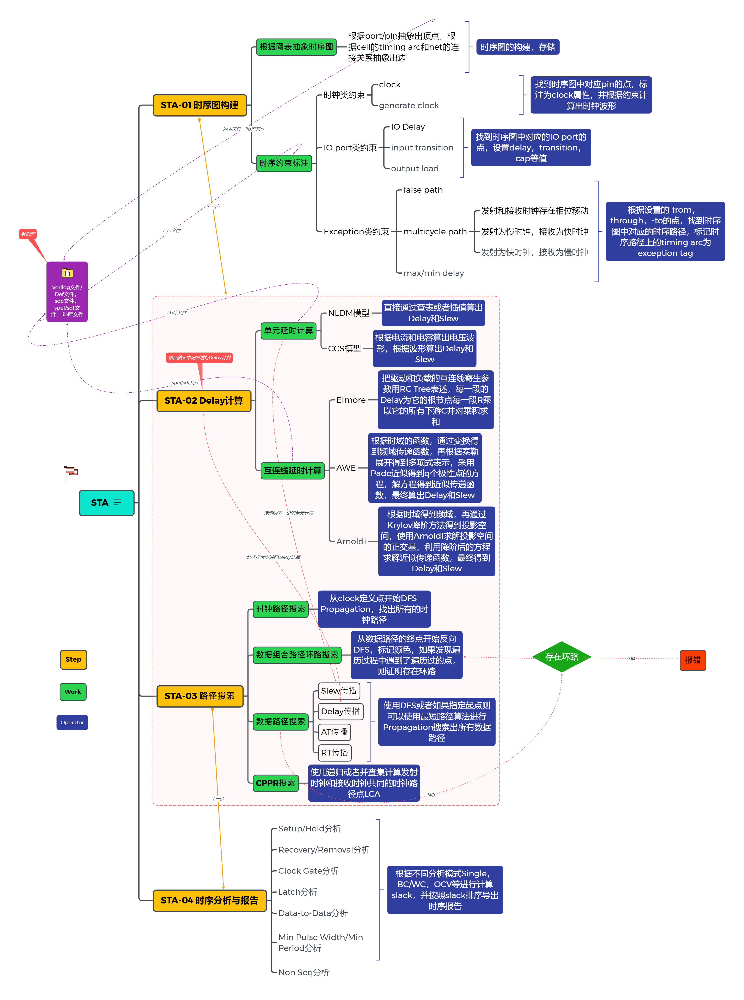


iSTA总体架构如上图所示，其中：

* **时序图构建** ：载入时序网表，并从网表中抽象出电路图，并应用时序约束到图当中。
* **Delay计算** ：从Liberty和SPEF中读取单元和互连线数据，计算单元和互连线Delay和Slew。
* **路径搜索** ：从电路图中搜索出需要分析的时序路径并记录时序路径。
* **时序分析和报告** ：对时序路径进行slack计算并以文本形式输出报告。

### 2.2 软件流程

> 描述软件的总体处理流程，**用文字描述清楚整个运行过程，并附上相应的代码**

软件总体流程如上图所示：

需要用到的数据文件包括：

- [ ] 网表文件：可以是def/lef或者verilog  netlist
- [ ] 时序约束文件：sdc，基于tcl语言的约束
- [ ] liberty：单元时序模型
- [ ] spef/sdf：互连线RC文件信息或者已经计算好的延时信息文件

STA操作层包括：

- [ ] 构建时序图，RC  Tree等基础数据结构
- [ ] 时序图检查，包括Loop的检查等
- [ ] 延时计算：单元和线网延时计算
- [ ] 路径搜索：搜索出待分析的时序路径
- [ ] 时序分析和报告：对时序路径分析计算并输出报告

STA接口层需在基础数据结构上封装对应的算子并预留接口。

### 2.3 子模块设计

> 描述软件的各个组成子模块的设计，独立完成功能，相互依赖关系等。这些模块的情况
>
> 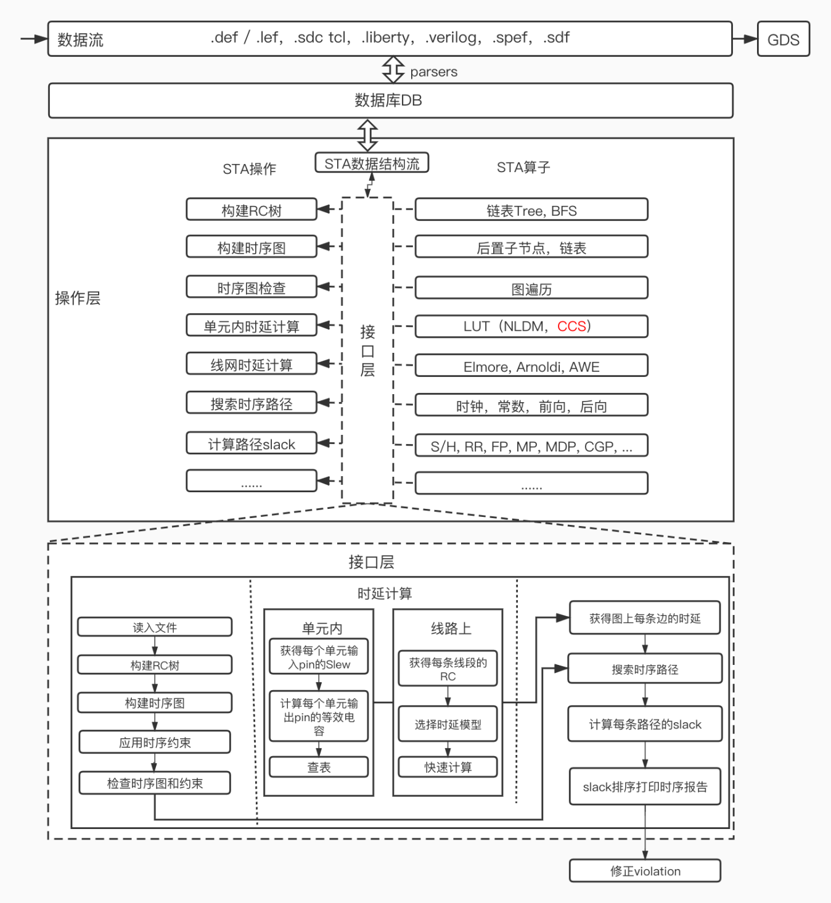

#### 2.3.1 构建时序图

如上图所示，从一个网表转化为时序图如上所示，一般来说基于Pin/Port来建立Graph节点，timing arc作为Graph边。对于时序分析而言，时序路径的起点为Clock Pin和输入Port，时序路径的终点为FF的数据端或者输出Port。

#### 2.3.2 延时计算

静态时序分析中的延迟计算主要包括单元内部延时和信号通过互连线的延时。

* 单元内延时计算
  单元内部延时可以使用非线性时延模型通过2D查找表(LUT)进行获取，该查找表以输入slew和输出负载电容为索引。

  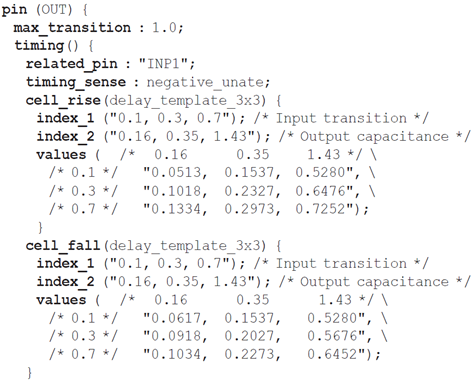
* 互连线延时计算：互连线延时需要通过特定延时模型计算得到，随着芯片设计工艺的提高，互连线延迟早已超过器件延迟成为主要芯片性能的关键因素，对单元内部延时和互连线上延时的建模和计算提出了更高的要求。
* Elmore模型

  对于每一条net，首先将其建模为一条由电阻和电容构成的RC tree

  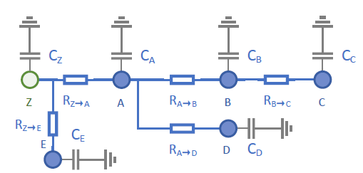

  对于从root节点到每一个输出pin的延时可以通过下述公式进行计算：

  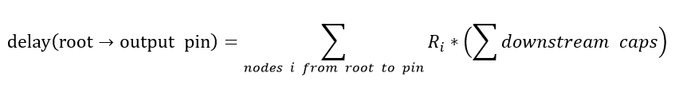
* 基于电路方程互连线延时计算

  求解互连线延时步骤：
  1通过查表得到互连线输入电流，计算输入波形达到电压阈值时间𝑡_𝑖𝑛，该过程中，需要先对net等效为一个π model，再对其计算等效电容。

  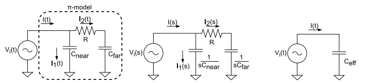

  2、通过求解微分方程得到输出波形电压值以及达到电压阈值时间𝑡_𝑜𝑢𝑡，芯片内部互连线耦合众多，在计算信号通过互连线的延时时，需要对互连线对参数(电阻、电容、电感)进行提取，对提取得到的参数建立等效电路模型，通过微分方程组进行描述, 通过改进的节点分析(MNA)方法对线性电路列出电路方程。

  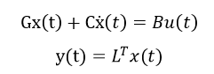

  其中G和C为电导和存储元件(电感、电容)矩阵，B和L为输入输出关联矩阵，节点电压值v和线性电路支路电流i值共同组成状态变量向量x。

  3、互连线延时=𝑡_𝑜𝑢𝑡-𝑡_𝑖𝑛电路模型降阶：由于芯片内部互连线耦合众多，对参数提取得到的RLC参数建立等效电路模型，通过微分方程组进行描述，电路方程中的状态变量的个数能够达到数十万个，计算的难度和复杂程度逐渐提升，对于这种级别的模型进行快速有效的分析是基本不可能实现的，对此需要引入模型降阶技术减少电路方程求解规模和加快计算速度。

  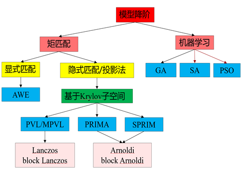
* 比较经典的降阶模型为PRIMA算法，思想如下：

  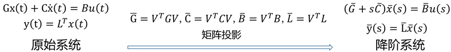

  该方法优缺点为：
  1.通过PRIMA算法的正交投影矩阵正投影后得到的降阶系统的传递函数与原始系统的传递函数的前n阶矩匹配。
  2.数值稳定
  3.保证无源性
  4.未保证块结构

#### 2.3.3 Timing Propagation

Timing Propagation包括Slew Propagation，Delay  Propagation，Const Propagation，AT Propagation等，其目标是在图上面标注slew，delay，arrive time等数据信息。

> Image not available
<!--  -->
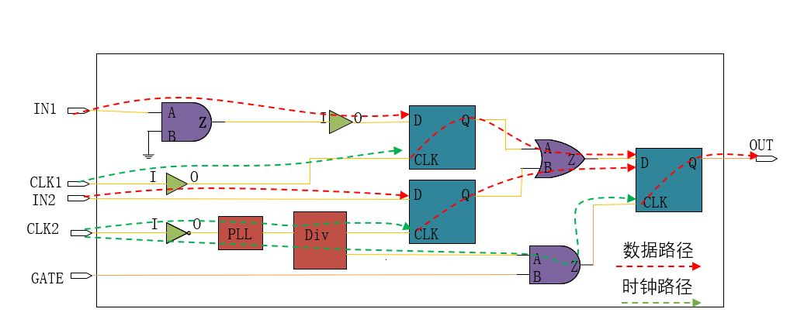

如上图所示，Timing Propagation主要沿着时序路径标记slew，delay，arrive time等。一条时序路径又可以分为时钟和数据两部分。时钟路径一般会从外部晶振通过pad输入到PLL中经过倍频相移，然后通过Mux电路，时钟分频电路，时钟buffer等分发给电路的时序单元。而数据路径会从输入port或者FF的Q端经过组合逻辑送入FF的D端。

#### 2.3.4 时序路径分析与报告

时序路径的分析与报告主要是对时序路径的slack计算，TNS，WNS等的计算，并按照格式化的表格输出。

<!--  -->
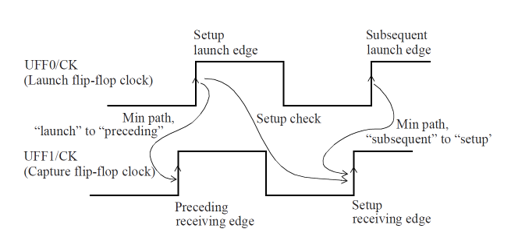

时序路径的分析常见的包括Setup/Hold Check，Recovery/Removal Check，Min Pulse Width/Min Period Check。如上图所示，setup  check默认是单周期检查，从发射延到接收延最长不能超过一个周期。

*Tlaunch* + *Tck2q* + *Tdp* < *Tcapture* + *Tcycle* – *Tsetup*

hold check默认是同周期检查，当前FF和下一个FF在同一个周期内完成。

<!--  -->


Recovery/Removal Check和Min Pulse Width/Min Period在当前版本暂时未实现。

### 2.4 评价指标

* **时序路径slack的准确性**

  可以参照商业工具PT，对同一条时序路径的slew，delay，arrive time等中间数据，以及时序路径的最终slack进行对比，看iSTA结果的准确性如何。
* **TNS的准确性**

  对于同一个时钟源出来的所有时序路径，可以对比TNS即路径为负的slack的总和。这样可以看看大量时序路径总的情况如何。
* **运行时间**

  STA工具作为分析工具，还需要把运行时间作为一个比较重要的指标，运行时间太长对于大的设计来说将是不可接受的。
* **内存占用大小**

  同样STA工具的内存占用也是非常重要的，如果内存占用太大可能导致服务器资源紧张。

### 2.5 算法设计

> 描述软件用到的主要算法，可以用伪代码的形式描述。

* **Timing Propagation算法：**

  Slew Propagation，Delay  Propagation, AT Propagation在这个版本都采用DFS的方式进行，DFS的起点是数据路径的终点，当找到Slew的起点，Delay的起点，或者路径的起点时则开始回溯，这样就能计算整条路径的Slew，Delay，或者Arrive Time（AT）。

  ```
  unsigned TimingPropagation(StaVertex* the_vertex) {
    if(the_vertex->isStart()) {
       // Calc the slew or delay or arrive time
       the_vertex->set_is_fwd();
       return 1;
    } 
    FOREACH_SNK_ARC(the_vertex, snk_arc) {
      if (!snk_arc->isDelayArc()) {
        continue;
      }

      auto* src_vertex = snk_arc->get_src();


      if (TimingPropagation(src_vertex)) {
        return 0;
      }

      /*do slew or delay or arrive time calc on the timing arc*/
    }

    the_vertex->set_is_fwd();
    return 1;
  }
  ```
* **电路模型降阶PRIMA 算法**

  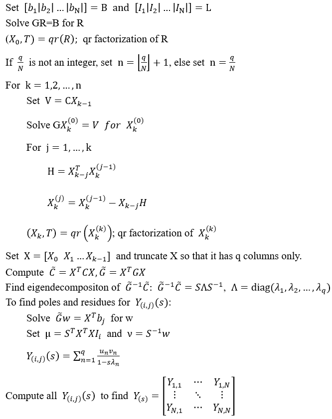
* **Algorithm (A,b)**

  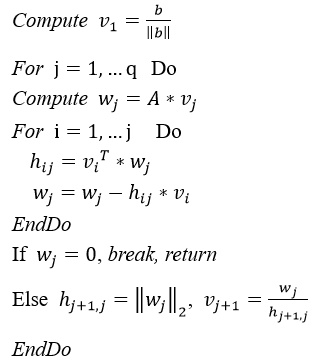

### 2.6 数据结构设计

下面介绍用到的主要数据结构

#### 2.6.1 Timing Graph

```
class StaGraph {
  Netlist* _nl;
  Set<StaVertex*> _port_vertexes;
  Set<StaVertex*> _start_vertexes;  //<! The start vertexes of the timing path.
  Set<StaVertex*> _end_vertexes;  //<! The endpoint vertexes of the timing path.
  Set<StaVertex*> _const_vertexes;  //<! The const vertexes.
  std::vector<std::unique_ptr<StaVertex>> _vertexes;
  std::vector<std::unique_ptr<StaArc>> _arcs;
  Map<DesignObject*, StaVertex*> _obj2vertex;
  Map<StaVertex*, DesignObject*> _vertex2obj;

}
```

Graph是时序分析的主要数据结构，需要包含点和边，以及点和网表的对应关系。

#### 2.6.2 StaVertex

```
 StaVertex {
  DesignObject* _obj;           //!< The mapped design object.
  unsigned _is_clock : 1;       //!< The vertex is clock pin.
  unsigned _is_port : 1;        //!< The vertex is design port.
  unsigned _is_start : 1;       //!<  The vertex is start node.
  unsigned _is_end : 1;         //!< The vertex is end node.
  unsigned _is_const : 1;       //!< The vertex is const.
  unsigned _color : 2;          //!< The vertex color.
  unsigned _is_slew_prop : 1;   //!< The vertex is slew propagated.
  unsigned _is_delay_prop : 1;  //!< The vertex is delay propagated.
  unsigned _is_bwd : 1;         //!< The vetex is req time backward propagated.
  unsigned _is_fwd : 1;  //!< The vertex is arrive time forward propagated.
  unsigned _level : 10;  //!< The vertex level, start from 1;
  unsigned _is_sdc_clock_pin : 1;  //!< The create_clock or
                                   //!< create_generate_clock constrain pin.
  unsigned _is_ideal_clock_latency : 1;  //!< The ideal clock latency set.
  unsigned _reserverd : 9;
  std::vector<StaArc*> _src_arcs;  //!< The timing arc sourced from the vertex.
  std::vector<StaArc*> _snk_arcs;  //!< The timing arc sinked to the vertex.
  StaDataBucket _slew_bucket;      //!< The slew data bucket.
  StaDataBucket _clock_bucket;     //!< The clock path data bucket.
  StaDataBucket _path_delay_bucket;  //!< The data path data bucket.
  std::mutex _fwd_mutex;             //!< The fwd mutex for mutiple thread.
  std::mutex _bwd_mutex;             //!< The bwd mutex for mutiple thread.

  std::array<std::optional<double>, TRANS_SPLIT> _max_cap;
  std::array<std::optional<double>, TRANS_SPLIT> _max_slew;
  std::optional<double> _max_fanout;

  StaPropagationTag _prop_tag;  //!< The propagation tag.
 
 }

```

Vertex是时序分析用到点，这个点可以基于pin或者inst来建立，但由于pin的差异性很大，基于inst建立虽然能够节省内存，但很多内容表达不好，所以一半基于pin/port建立。在数据结构设计的时候需要对Vertex的属性，以及Vertex的连接关系，Vertex上保存的数据进行描述，其中包括是不是clock pin，是不是start或者end，是不是常量节点，vertex的color主要用来在检查loop的时候用到。数据信息包含slew，以及时钟path的arrive time，数据path的arrive time信息。

#### 2.6.3 StaArc

```
class StaArc {
  StaVertex* _src;
  StaVertex* _snk;
  StaDataBucket _arc_delay_bucket;
}

class StaNetArc : public StaArc {
   Net* _net;
}

class StaInstArc : public StaArc {
  LibertyArc* _lib_arc;  //!< The mapped to lib arc.
  Instance* _inst;       //!< The owned inst.
}
```

Arc是有向图的连接关系表示，包含起点和终点，Arc在时序分析时又分为NetArc和InstArc，分别用来描述Inst上时序关系和Inst之间的连接关系。

#### 2.6.4 RcTree

```
class RcTree {
  friend class RcNet;
  friend class ArnoldiNet;

 public:
  void updateRcTiming();
  void insertSegment(const std::string&, const std::string&, float);
  RctNode* insertNode(const std::string&, float = 0.0f);
  void insertEdge(const std::string&, const std::string&, float);
  void insertEdge(RctNode* node1, RctNode* node2, double res, bool in_order);

  float delay(const std::string& name);
  float delay(const std::string& name, AnalysisMode mode, TransType trans_type);

  float slew(const std::string& name, AnalysisMode mode, TransType trans_type,
             float input_slew);

  [[nodiscard]] size_t numNodes() const { return _nodes.size(); }
  [[nodiscard]] size_t numEdges() const { return _edges.size(); }

  const auto& get_nodes() { return _nodes; }

  RctNode* node(const std::string&);

  void printGraphViz();

 private:
  RctNode* _root{nullptr};

  std::map<std::string, RctNode> _nodes;
  std::list<RctEdge> _edges;

  void updateLoad(RctNode*, RctNode*);
  void updateDelay(RctNode*, RctNode*);
  void updateLDelay(RctNode* parent, RctNode* from);
  void updateResponse(RctNode* parent, RctNode* from);

  RctNode* rcNode(const std::string&);
};
```

RcTree是对一条net中电阻、电容值的建模，通过构建完成的RC tree，可以使用Elmore模型计算互连线延时。

#### 2.6.5 ArnoldiNet

```
class ArnoldiNet : public RcNet {
 public:
  explicit ArnoldiNet(pcl::Net* net);
  ~ArnoldiNet() override = default;

  void updateRcTiming(const spef::Net& spef_net) override;

  std::optional<double> delay(Pin& to, double from_slew,
                              std::optional<LibetyCurrentData*> output_current,
                              AnalysisMode mode, TransType trans_type) override;
  std::optional<double> slew(Pin& to, double from_slew,
                             std::optional<LibetyCurrentData*> output_current,
                             AnalysisMode mode, TransType trans_type) override;

  void trapezoidalSlewAndDelayCal(std::vector<double> current, double time,
                                  TransType trans_type, double vdd);

  void set_nodal_caps(std::vector<double> nodal_caps) {
    _nodal_caps = std::move(nodal_caps);
  }

  void set_nodal_resistances(std::vector<double> nodal_resistances) {
    _nodal_resistances = std::move(nodal_resistances);
  }

  double getDelay(
      std::function<std::vector<double>(double, double, int)>&& get_current,
      double start_time, double end_time, int num_sim_point,
      AnalysisMode analysis_mode, TransType trans_type, Pin* pin);

  double getSlew(
      std::function<std::vector<double>(double, double, int)>&& get_current,
      double start_time, double end_time, int num_sim_point,
      AnalysisMode analysis_mode, TransType trans_type, Pin* pin);

 private:
  void calcDelayAndSlew(
      std::function<std::vector<double>(double, double, int)>&& get_current,
      double start_time, double end_time, int num_sim_point,
      AnalysisMode analysis_mode, TransType trans_type);

  void trapezoidalSlewAndDelayCal(
      std::function<std::vector<double>(double, double, int)>&& get_current,
      double start_time, double end_time, int num_sim_point,
      TransType trans_type);
  void trapezoidalSlewAndDelayCalROM(
      std::function<std::vector<double>(double, double, int)>&& get_current,
      double start_time, double end_time, int num_sim_point,
      TransType trans_type);

  void identityRoot();
  void saveResAndCap(AnalysisMode analysis_mode, TransType trans_type);

  std::map<RctNode*, int> _nodes_id;

  bool _is_calculated = false;
  std::vector<double> _nodal_caps;
  std::unique_ptr<MatrixXd> _conductances;
  std::vector<double> _nodal_resistances;
  std::vector<std::vector<double>> _nodes_resistances;
  std::vector<RctNode*> _load_nodes;
  std::map<RctNode*, double> _load_nodes_delay;
  std::map<RctNode*, double> _load_nodes_slew;
};
```

ArnoldiNet继承了RcNet，基于通过ArnoldiNet构建的Rc Tree，建立电路方程，通过求解微分方程计算互连线延时。

#### **2.6.6 ArnoldiROM**

```
class ArnoldiROM {
 public:
  ArnoldiROM() = default;
  ~ArnoldiROM() = default;
  struct CircuitParamInit {
    MatrixXd G;
    MatrixXd C;
    VectorXd B;
    VectorXd L;
  };
  struct CircuitParamTrans {
    MatrixXd G_rom;
    MatrixXd C_rom;
    VectorXd B_rom;
    VectorXd L_rom;
  };

  void arnoldiTransfer(const CircuitParamInit& cpi, CircuitParamTrans& cpt,
                       int k);

  MatrixXd GTrans(MatrixXd v, MatrixXd G) {
    MatrixXd G_rom = v.transpose() * G * v;
    return G_rom;
  }

  MatrixXd CTrans(MatrixXd v, MatrixXd C) {
    MatrixXd C_rom = v.transpose() * C * v;
    return C_rom;
  }

  VectorXd BTrans(MatrixXd v, VectorXd B) {
    VectorXd B_rom = v.transpose() * B;
    return B_rom;
  }

  VectorXd LTrans(MatrixXd v, VectorXd L) {
    VectorXd L_rom = v.transpose() * L;
    return L_rom;
  }

  MatrixXd orthogonalBasis(const MatrixXd& G, const MatrixXd& C, int k);

 private:
  MatrixXd arnoldi(MatrixXd A, VectorXd u, int k);
  MatrixXd blockArnoldi(MatrixXd A, MatrixXd R, int q, int N);
};
```

ArnoldiROM通过Arnoldi算法对电路方程中的系数矩阵进行正交投影，将原始的大规模的电路方程降阶为一个小的电路模型，同时保持原有电路结构，提升求解速度。

## 3. 接口设计

### 3.1 外部接口

> 包括用户界面、软件接口。

外部接口主要包括读入verilog的网表文件，载入liberty文件，读时序约束文件sdc，读RC信息Spef文件。

```
class Sta {
  unsigned readVerilog(const char* verilog_file);
  unsigned readLiberty(const std::vector<const char*>& lib_files);
  unsigned readSdc(const char* sdc_file);
  unsigned readSpef(const char* spef_file);
}
```

对外输出接口包括报告时序Path，slew，cap，fanout，skew，写出verilog网表等的接口。

```
  class Sta {
  unsigned reportPath(const char* rpt_file_name);
  unsigned reportTrans(const char* rpt_file_name);
  unsigned reportCap(const char* rpt_file_name);
  unsigned reportFanout(const char* rpt_file_name);
  unsigned reportSkew(const char* rpt_file_name, AnalysisMode analysis_mode);
  unsigned reportFromThroughTo(const char* rpt_file_name,
                               AnalysisMode analysis_mode, const char* from_pin,
                               const char* through_pin, const char* to_pin);
  unsigned reportTiming();
  
  void writeVerilog(const char* verilog_file_name, bool sort,
                    bool include_pwr_gnd_pins);
  
  }

```

### 3.2 内部接口

> 内部模块之间的接口。

内部接口主要是模块之间调用的接口，iSTA工具选用仿函数，统一了内部接口调用，所有的操作都在Graph，Vertex，Arc上进行。

```
class StaFunc {
 public:
  StaFunc();
  virtual ~StaFunc();
  virtual unsigned operator()(StaGraph* the_graph);
  virtual unsigned operator()(StaVertex* the_vertex);
  virtual unsigned operator()(StaArc* the_arc);
  virtual unsigned operator()(StaClock* the_clock);
  };
  
 class StaSlewPropagation : public StaFunc {
 public:
  unsigned operator()(StaArc* the_arc) override;
  unsigned operator()(StaVertex* the_vertex) override;
  unsigned operator()(StaGraph* the_graph) override;
};

class StaDelayPropagation : public StaFunc {
 public:
  unsigned operator()(StaArc* the_arc);
  unsigned operator()(StaVertex* the_vertex);
  unsigned operator()(StaGraph* the_graph);
};

class StaDataPropagation : public StaFunc {
public:
	unsigned operator()(StaGraph* the_graph) override;
};

class StaFwdPropagation : public StaFunc {
 public:
  unsigned operator()(StaVertex* the_vertex) override;
  unsigned operator()(StaArc* the_arc) override; 
 };
 
 class StaBwdPropagation : public StaFunc {
 public:
  unsigned operator()(StaVertex* the_vertex) override;
  unsigned operator()(StaArc* the_arc) override;
  };
```

## 4. 测试报告

### 4.1 测试环境

> *描述测试环境。*

测试环境选用linux服务器，基于gcc10.3编译，测试设计采用一生一芯三期流片的芯片。

### 4.2 测试结果

> 描述测试人员应该覆盖的功能点

| **测试****编号** | **测试****版本** | **测试功能点** | **测试****描述**        |
| ---------------------- | ---------------------- | -------------------- | ----------------------------- |
| TR01                   | V1.0                   | load_liberty         | 测试载入liberty功能           |
| TR02                   | V1.0                   | read_verilog         | 测试读入verilog功能           |
| TR03                   | V1.0                   | read_spef            | 测试读入spef功能              |
| TR04                   | V1.0                   | read_sdc             | 测试source sdc功能            |
| TR05                   | V1.0                   | simple_design        | 一个简单的网表测试整个Sta功能 |
| TR06                   | V1.0                   | nutshell             | 用果壳进行性能测试            |
| TR07                   | V1.0                   | ysyx                 | 用一生一芯三期进行性能测试    |
|                        |                        |                      |                               |

### 4.3 比对

果壳和一生一芯的例子在PT和iSTA之间做了对比，其中短路径比较精确，长路径会偏差比较大。

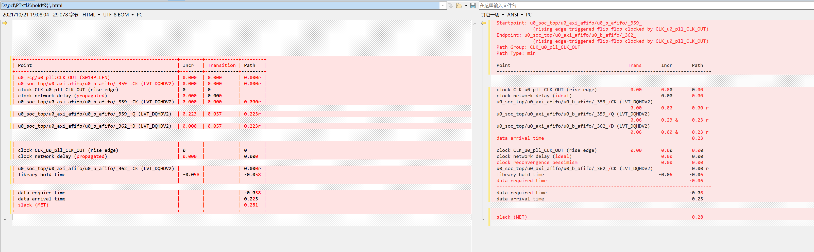

## 5. TO BE DONE

### 5.1 疑难问题

> *描述重点难点问题* ；
>
> *说明在开发过程中遇到的问题，以及解决方法。例如：方法的选择、参数的处理、需要说明的其他具体问题。如果有不能正常工作的模块，说明具体情况，猜测可能的原因。*

### 5.2 待研究

> *待研究问题；*

对于支持 28nm 工艺特性的功能需要待研究。
